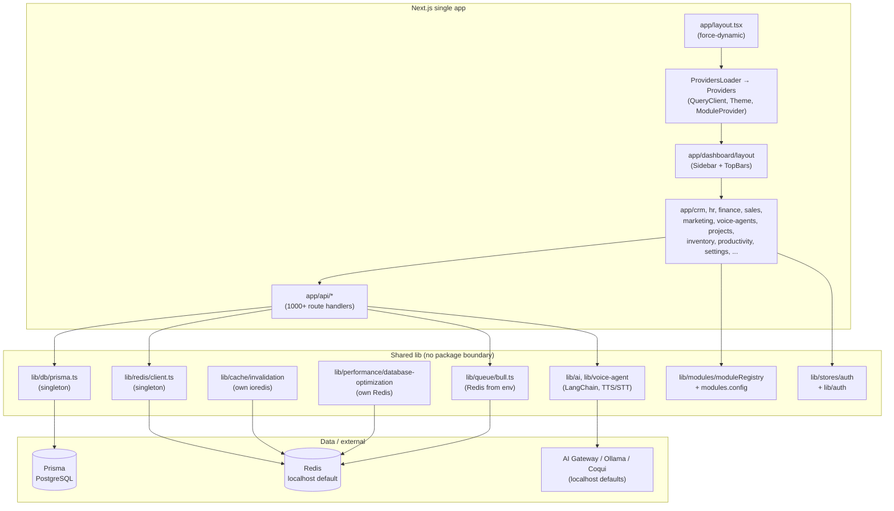

# PayAid V3 – Phase 0 Audit (Read & Understand Context)

**Purpose:** Scan repo structure, identify module boundaries, coupling points, and env/infra assumptions. No code changes.

---

## 1. Repo structure

| Path | Purpose |
|------|--------|
| `app/` | **Single Next.js App Router app** – all routes (marketing, dashboard, crm, hr, finance, sales, marketing, inventory, voice-agents, projects, productivity, spreadsheet, settings, admin, etc.). 174+ layout files; 1000+ API route files under `app/api/`. |
| `lib/` | **Shared server/client lib** – db, redis, queue, cache, ai, auth, hr, crm, finance, voice-agent, jobs, middleware, modules, etc. Heavy cross-domain usage. |
| `prisma/` | **Single Prisma schema** – `schema.prisma` (~9200+ lines, 100+ models), migrations, seeds. No `packages/db` yet. |
| `components/` | **Shared UI** – layout (Header, Sidebar, CRMSidebar, FinanceSidebar, etc.), auth, crm, hr, modules, shared. Used by all modules. |
| `contexts/` | **React contexts** – e.g. `ModuleContext` (module nav, permissions). Used app-wide. |
| `packages/` | **Partial** – only `@payaid/auth-sdk` (and possibly oauth-client). No Turborepo; no `apps/` or `packages/db`, `packages/ui`, `packages/core`. |
| `crm-module/`, `hr-module/` | **Decoupled module dirs** – contain their own `app/api/` and middleware. Next config mentions syncing from these into `app/api/` via `scripts/sync-module-routes-to-monolith.ts`. |

**No Turborepo:** No `turbo.json` at repo root. Single `next.config.js` and single `package.json` for the whole app.

---

## 2. Major functional domains (module boundaries)

| Domain | App routes | Lib | Notes |
|--------|------------|-----|--------|
| **CRM** | `app/crm/[tenantId]/` (Leads, Deals, Contacts, Tasks, Activities, CPQ, Agents, etc.) | `lib/crm/`, `lib/territories/`, `lib/sales-automation/` | Core; heavy AI (lead scoring, deal rot). |
| **HR** | `app/hr/[tenantId]/` (Employees, Payroll, Leave, Attendance, Hiring, Tax, Onboarding, OrgChart, Reports) | `lib/hr/`, `lib/payroll/` | Payroll, statutory, leave, hiring. |
| **Finance** | `app/finance/[tenantId]/` (Invoices, Accounting, Payments, GST, Billing, Purchase Orders, Recurring, Tax) | `lib/finance/`, `lib/invoices/`, `lib/billing/` | Invoicing, P&amp;L, bank reconcile. |
| **Sales** | `app/sales/[tenantId]/` (Orders, etc.) | `lib/sales/`, `lib/quotes/` | Orders, quotes. |
| **Marketing** | `app/marketing/[tenantId]/` (Campaigns, Social, Sequences, Segments, Ads, AI-Influencer, Creative Studio) | `lib/marketing/`, `lib/segments/`, `lib/ai-influencer/` | Campaigns, nurture, social. |
| **Voice / AI** | `app/voice-agents/[tenantId]/`, `app/ai-chat/`, `app/ai-cofounder/`, `app/ai-insights/`, `app/ai-studio/` | `lib/voice-agent/`, `lib/ai/`, `lib/ai-helpers/` | TTS/STT, LangChain, Groq, gateway, Coqui/VEXYL/Bhashini. |
| **Projects** | `app/projects/[tenantId]/` (Projects, Tasks, Gantt) | `lib/projects/`, `lib/productivity/` | Tasks, time entries (N+1 noted). |
| **Inventory** | `app/inventory/[tenantId]/` (Products, Warehouses, Stock, Suppliers) | `lib/inventory/` | Stock, forecasting. |
| **Productivity** | `app/productivity/[tenantId]/`, `app/spreadsheet/[tenantId]/`, `app/docs/`, `app/drive/`, `app/meet/`, `app/pdf/`, `app/slides/` | `lib/productivity/`, `lib/spreadsheet/` | Docs, spreadsheets, drive. |
| **Settings** | `app/settings/[tenantId]/` (Profile, Tenant, Users, Billing, Activity, Modules) | `lib/settings/`, `lib/tenant/` | Cross-cutting. |
| **Dashboard / Home** | `app/dashboard/`, `app/home/`, `app/tenant-home/` | `lib/dashboard-redirects.ts` | Shell; redirects to module homes. |
| **Admin / Super** | `app/admin/`, `app/super-admin/` | `lib/` (various) | Tenant/user management. |
| **Industry / verticals** | `app/agriculture/`, `app/healthcare/`, `app/restaurant/`, etc. | `lib/verticals/`, `lib/industries/` | Vertical-specific. |

---

## 3. Key file locations

| Asset | Location |
|-------|----------|
| **Root layout** | `app/layout.tsx` – `force-dynamic` app-wide (comment: avoid Vercel 45m timeout on 1085+ routes). Wraps with `ProvidersLoader` → `Providers` (QueryClient, ThemeProvider, ModuleProvider). |
| **Dashboard layout** | `app/dashboard/layout.tsx` – client layout: ProtectedRoute, Sidebar (CRM/Finance/Sales/Default), Header or module TopBars (CRM, Finance, Sales, HR, Marketing, Projects, Inventory), NewsSidebar. Single shell for all module routes that don’t have their own layout. |
| **Prisma client** | `lib/db/prisma.ts` – singleton via Proxy, globalThis cache; uses `DATABASE_URL` / `DATABASE_DIRECT_URL`; connection pooling (connection_limit, pool_timeout, connect_timeout); Supabase pooler support; `server-only`. Alias: `@payaid/db` → `lib/db/prisma` in next.config. |
| **Prisma schema** | `prisma/schema.prisma` – single datasource `db` with `env("DATABASE_URL")`; no Accelerate. |
| **Redis (primary)** | `lib/redis/client.ts` – singleton `getRedisClient()`; default `REDIS_URL || 'redis://localhost:6379'`; no-op when Vercel+localhost or production+localhost; ioredis with retries/timeouts; exports `Cache` class and `cache` instance. |
| **Redis (other)** | `lib/cache/invalidation.ts` – **separate** ioredis client (creates its own from `REDIS_URL`), used for tag-based invalidation. `lib/cache/multi-layer.ts` – uses `getRedisClient()` from `lib/redis/client`. `lib/cache/redis.ts` – **in-memory only** (SimpleCache), commented-out Redis. `lib/performance/database-optimization.ts` – **own** lazy Redis from `REDIS_URL || 'redis://localhost:6379'`. |
| **Bull queues** | `lib/queue/bull.ts` – three queues (high/medium/low); Redis from `parseRedisUrl(process.env.REDIS_URL)` with fallback `'redis://localhost:6379'`; uses same Redis config but **not** the singleton from `lib/redis/client.ts` (creates connection from env). |
| **Next config** | `next.config.js` – `ignoreBuildErrors: true`, `optimizePackageImports: ['lucide-react', '@radix-ui/react-icons', 'framer-motion']`, bundle analyzer when `ANALYZE=true`, rewrites `/dashboard/:tenantId/:path*` → `/dashboard/:path*`, `@payaid/db` alias, externals for bull/dockerode/etc. |
| **Monorepo** | No `turbo.json`. No `apps/` or `packages/db`, `packages/ui`, `packages/core`. `packages/` has `@payaid/auth-sdk`. `crm-module/`, `hr-module/` exist but are synced into main app, not run as separate apps. |

---

## 4. Module boundaries and coupling

- **Single app shell:** All authenticated modules go through `app/dashboard/layout.tsx` (or equivalent tenant layout) and share:
  - `ProvidersLoader` → `Providers` (QueryClient, ThemeProvider, **ModuleProvider**).
  - `ModuleProvider` uses `lib/modules/moduleRegistry` + `lib/stores/auth` (Zustand) for enabled modules and routes.
  - Sidebar/TopBar chosen by path (e.g. `detectModuleFromPath(pathname)` → CRMSidebar, FinanceSidebar, etc.).
- **Shared data layer:** Every module imports `prisma` from `lib/db/prisma.ts` (or `@payaid/db`). No per-app DB; one schema, one client.
- **Shared auth/tenant:** `lib/stores/auth`, `lib/auth/`, `lib/tenant/resolve-tenant.ts`, `lib/middleware/tenant-resolver.ts` used across CRM, HR, Finance, etc.
- **Shared UI:** Same `components/layout`, `components/modules`, `components/auth`; no package boundary.
- **API surface:** All under `app/api/` – e.g. `app/api/crm/`, `app/api/hr/`, `app/api/ai/`, `app/api/v1/voice-agents/`. No per-module deploy; one build serves all.
- **Module config:** `lib/modules.config.ts` (client) and `lib/modules/moduleRegistry.ts` define modules and routes; both used app-wide.

---

## 5. Env-dependent and localhost assumptions

| Env / usage | Where | Issue |
|-------------|--------|--------|
| **REDIS_URL** | `lib/redis/client.ts`, `lib/queue/bull.ts`, `lib/cache/invalidation.ts`, `lib/performance/database-optimization.ts` | Default `redis://localhost:6379`. Production must not use localhost; currently guarded by `shouldSkipRedis()` (Vercel+localhost → no-op). Bull still parses `REDIS_URL` with localhost default. |
| **AI_GATEWAY_URL** | `lib/ai/gateway.ts` (`GATEWAY_URL`), `lib/voice-agent/stt.ts`, `lib/voice-agent/tts-free.ts`, `lib/voice-agent/service-manager.ts` | Default `http://localhost:8000`. Used for TTS/STT and gateway; if unset in prod, calls go to localhost and fail/hang. |
| **OLLAMA_BASE_URL** | `lib/voice-agent/service-manager.ts` | Default `http://localhost:11434`. Same risk in prod/demo. |
| **TEXT_TO_SPEECH_URL** | `lib/voice-agent/tts-free.ts` | Default `http://localhost:7861` (Coqui). Local-only. |
| **STT/TTS services** | `lib/voice-agent/tts.ts`, `lib/voice-agent/stt.ts`, `lib/voice-agent/tts-free.ts` | Coqui, VEXYL, Bhashini, IndicParler – mix of local and cloud; no single “prod-safe” config or feature flag to disable in prod. |
| **DATABASE_URL / DATABASE_DIRECT_URL** | `lib/db/prisma.ts` | Correctly required; no localhost default. |
| **NEXTAUTH_SECRET / JWT** | Not validated at startup in a single place; used in auth flows. | No central `config/env.ts` validation. |

---

## 6. Mermaid diagram (high-level)

---

## 7. Summary for Teja

- **Module boundaries:** Domains (CRM, HR, Finance, Voice, etc.) are **logical** only: same app, same layout, same Prisma/Redis, same build. `crm-module` and `hr-module` exist but are synced into the monolith, not deployed separately.
- **Coupling:** One root layout with `force-dynamic`, one dashboard layout with module-specific sidebars/topbars, one Prisma client, **multiple Redis clients** (redis/client, cache/invalidation, performance/database-optimization, Bull), and shared ModuleProvider/auth.
- **Env/localhost:** Redis defaults to localhost and is no-op’d in prod when URL is localhost; Bull still uses that default. AI/TTS/STT (AI_GATEWAY_URL, OLLAMA_BASE_URL, TEXT_TO_SPEECH_URL) default to localhost with no production-safe off switch or cloud-only path – demos can hang or fail if those services are down or not set.
- **No Turborepo:** Single Next app; no `apps/*` or `packages/db`, `packages/ui`, `packages/core`. Next step for Phase 1: env validation and single Redis; then Phase 2: introduce Turborepo and move code into apps/packages.

---

## 8. Checklist (Phase 0)

- [x] Scan repo structure (app, lib, prisma, components, packages).
- [x] List major domains (CRM, HR, Finance, Voice, etc.).
- [x] Locate root layout, Prisma client, Redis clients, Bull, Next config.
- [x] Confirm no Turborepo (no turbo.json, no apps/packages layout).
- [x] Summarize module boundaries and cross-module coupling.
- [x] Identify env-dependent and localhost-hard-coded services.
- [x] Document in PHASE_0_AUDIT.md with Mermaid diagram.

**No code changed.** Ready to proceed to **Phase 1 – Environment & Infrastructure Sanity**.
