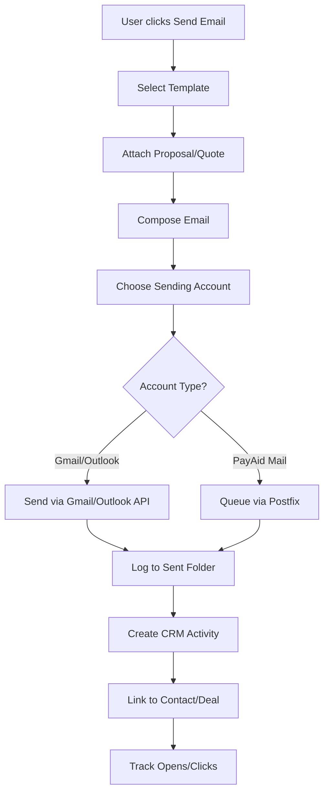
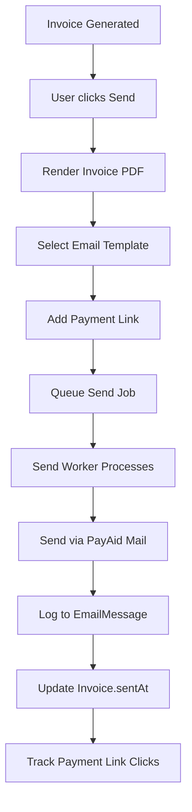
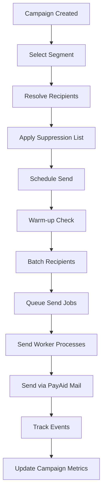

# PayAid Mail - Complete Implementation Plan

**Version:** 1.0  
**Date:** April 23, 2026  
**Status:** 🔵 **Ready for Implementation**

**Cost conversion note:** INR estimates in this document use **USD 1 ≈ ₹83** (rounded, Apr 2026).

---

## Executive Summary

This document outlines the complete architecture and implementation plan for **PayAid Mail**, an integrated email layer that enables CRM, Marketing, Finance, and other modules to send/receive emails while maintaining platform speed, avoiding external vendor costs, and preferring self-hosted infrastructure.

**Key Decision:** Build an **email operating layer for PayAid** (not a Gmail/Zoho competitor). Use a two-lane architecture:
1. **Connect external inboxes** via OAuth (Gmail/Outlook/custom IMAP)
2. **Self-hosted outbound stack** for PayAid-owned sending

---

## 1. Current State Analysis

### 1.1 What Exists (Already Implemented)

✅ **Database Schema** (Prisma)
- `EmailAccount` - Multi-provider support (gmail, outlook, custom IMAP/SMTP)
- `EmailFolder` - Folder organization (inbox, sent, drafts)
- `EmailMessage` - Full message storage with threading
- `EmailAttachment` - Attachment handling
- `EmailContact` - Contact frequency tracking
- `EmailForwardingRule` - Auto-forwarding rules
- `EmailAutoResponder` - Out-of-office responders
- `EmailTemplate` - Template library
- `Campaign` - Marketing campaign tracking
- `EmailBounce` - Bounce management

✅ **Core Services Implemented**
- `lib/email/gmail.ts` - Gmail OAuth integration, inbox sync, send/reply
- `lib/email/sync-service.ts` - Unified sync for Gmail/Outlook, CRM linking, auto-import leads
- `lib/email/sendgrid.ts` - SendGrid integration (fallback)
- `lib/email/templates.ts` - Pre-built email templates
- `lib/email/tracking-injector.ts` - Open/click tracking injection
- `lib/ai/email-automation.ts` - AI-powered response generation
- `lib/ai/email-assistant.ts` - Email categorization, sentiment analysis

✅ **UI Components**
- `components/marketing/EmailCampaignBuilder.tsx` - Campaign builder UI
- `components/marketing/EmailCampaignList.tsx` - Campaign management

✅ **OAuth2 SSO Infrastructure**
- Centralized OAuth2 provider at core module
- Cross-module token sharing via HTTP-only cookies
- Automatic token refresh mechanism

### 1.2 What's Partially Implemented

🟡 **Partially Complete**
- Gmail connection working, Outlook connection exists but needs testing
- CRM email linking exists but limited to Gmail/Outlook
- Campaign sending UI exists but backend needs completion
- Email templates defined but not fully integrated into sending flow
- Tracking pixel/link injection exists but needs event processing backend

### 1.3 What's Missing

❌ **Not Yet Implemented**
- **Self-hosted outbound SMTP infrastructure** (Postfix/Dovecot/Rspamd)
- **Generic IMAP/SMTP connection** for non-Gmail/Outlook accounts
- **Background job queue** for email sending (Bull/BullMQ)
- **Email sending worker** for processing send queue
- **Campaign sending engine** with throttling and warm-up
- **Deliverability monitoring** (bounce processing, sender reputation)
- **DNS/SPF/DKIM/DMARC management** UI
- **Abuse handling workflow** (complaint processing, blacklist monitoring)
- **API endpoints** for:
  - Email account CRUD
  - Folder/message management
  - Send email (CRM, Finance, Marketing)
  - Campaign execution
  - Tracking event ingestion

---

## 2. Recommended Architecture

### 2.1 Three-Layer Architecture

```
┌─────────────────────────────────────────────────────────────────┐
│                    LAYER 1: MAIL CONNECTIONS                     │
│  ┌──────────────┐  ┌──────────────┐  ┌──────────────┐          │
│  │ Gmail OAuth  │  │Outlook OAuth │  │ IMAP/SMTP    │          │
│  │   Sync       │  │   Sync       │  │   Connect    │          │
│  └──────────────┘  └──────────────┘  └──────────────┘          │
└─────────────────────────────────────────────────────────────────┘
                              ↓
┌─────────────────────────────────────────────────────────────────┐
│                   LAYER 2: PAYAID MAIL CORE                      │
│  ┌──────────────────────────────────────────────────────────┐  │
│  │  - Account Registry   - Token Vault   - Send Queue       │  │
│  │  - Sync Workers       - Threading     - Attachment Store │  │
│  │  - Activity Logs      - CRM Linkage   - Campaign Engine  │  │
│  └──────────────────────────────────────────────────────────┘  │
└─────────────────────────────────────────────────────────────────┘
                              ↓
┌─────────────────────────────────────────────────────────────────┐
│            LAYER 3: SELF-HOSTED MAIL INFRASTRUCTURE              │
│  ┌──────────────┐  ┌──────────────┐  ┌──────────────┐          │
│  │   Postfix    │  │   Dovecot    │  │   Rspamd     │          │
│  │ (Outbound)   │  │ (IMAP/Auth)  │  │ (Anti-spam)  │          │
│  └──────────────┘  └──────────────┘  └──────────────┘          │
│                                                                  │
│  Optional: mailcow (Postfix+Dovecot+Rspamd+SOGo packaged)       │
└─────────────────────────────────────────────────────────────────┘
```

### 2.2 Architecture Decision: Why This Approach?

**✅ Best Option: External Inbox Connect + Self-Hosted Outbound**

Reasons:
1. **Fastest to ship** - Leverage existing Gmail/Outlook OAuth integration
2. **Lowest engineering risk** - No need to build full mailbox hosting
3. **No SaaS vendor cost** - Self-host outbound, use customer's Gmail for personal mail
4. **Immediate value** - Users can connect Gmail/Outlook today
5. **Focused scope** - Optimize for CRM/Marketing/Finance sending, not webmail UI
6. **Operational simplicity** - Avoid full mailbox hosting, anti-spam ops, webmail development

**❌ Avoid for Now: Full Self-Hosted Mailbox Product**

Why not:
- Requires full webmail UI (like Gmail/Zoho)
- Heavy operational burden (spam reputation, abuse handling, deliverability)
- Distracts from core PayAid business OS value
- Slower to market
- Higher risk of poor deliverability if not managed correctly

---

## 3. Exact Data Model

### 3.1 Core Entities (Already in Schema)

```typescript
// Email account with provider credentials
model EmailAccount {
  id                  String
  tenantId            String
  userId              String
  email               String
  displayName         String?
  provider            String  // "gmail" | "outlook" | "custom" | "payaid"
  providerAccountId   String?
  providerCredentials Json?   // Encrypted OAuth tokens or IMAP/SMTP credentials
  imapHost            String?
  smtpHost            String?
  imapPort            Int
  smtpPort            Int
  isActive            Boolean
  lastSyncAt          DateTime?
  folders             EmailFolder[]
  messages            EmailMessage[]
}

// Email folder (inbox, sent, drafts, custom)
model EmailFolder {
  id           String
  accountId    String
  name         String
  type         String  // "inbox" | "sent" | "drafts" | "custom"
  unreadCount  Int
  totalCount   Int
  messages     EmailMessage[]
}

// Email message with full metadata
model EmailMessage {
  id          String
  accountId   String
  folderId    String
  messageId   String
  fromEmail   String
  fromName    String?
  toEmails    String[]
  ccEmails    String[]
  subject     String
  body        String?
  htmlBody    String?
  isRead      Boolean
  threadId    String?
  inReplyTo   String?
  sentAt      DateTime?
  receivedAt  DateTime
  contactId   String?   // Link to CRM Contact
  attachments EmailAttachment[]
}

// Marketing campaign
model Campaign {
  id              String
  name            String
  type            String   // "email" | "sms" | "whatsapp"
  subject         String?
  content         String
  status          String   // "draft" | "scheduled" | "sending" | "sent"
  recipientCount  Int
  sent            Int
  opened          Int
  clicked         Int
  bounced         Int
  scheduledFor    DateTime?
  tenantId        String
}

// Email template library
model EmailTemplate {
  id          String
  tenantId    String
  name        String
  category    String?   // "crm" | "finance" | "marketing"
  subject     String
  htmlContent String
  variables   Json?     // {{name}}, {{company}}, etc.
  timesUsed   Int
  isActive    Boolean
}
```

### 3.2 New Entities Needed

```typescript
// Email send queue (for async processing)
model EmailSendJob {
  id          String   @id @default(cuid())
  tenantId    String
  accountId   String   // Which account to send from
  fromEmail   String
  toEmails    String[]
  ccEmails    String[]
  bccEmails   String[]
  subject     String
  htmlBody    String
  textBody    String?
  replyTo     String?
  
  // Campaign/CRM context
  campaignId  String?
  contactId   String?
  dealId      String?
  
  // Job status
  status      String   @default("pending") // pending | processing | sent | failed
  attempts    Int      @default(0)
  maxRetries  Int      @default(3)
  error       String?
  
  // Scheduling
  scheduledFor DateTime?
  sentAt      DateTime?
  
  // Tracking
  trackingEnabled Boolean @default(true)
  trackingId      String?
  
  // Attachments (stored as JSON array of S3/storage URLs)
  attachments Json?
  
  createdAt   DateTime @default(now())
  updatedAt   DateTime @updatedAt
  
  @@index([tenantId, status])
  @@index([accountId, status])
  @@index([campaignId])
  @@index([scheduledFor])
}

// Email tracking events (opens, clicks)
model EmailTrackingEvent {
  id          String   @id @default(cuid())
  tenantId    String
  messageId   String   // EmailMessage.id or tracking pixel ID
  contactId   String?
  campaignId  String?
  eventType   String   // "open" | "click" | "bounce" | "spam"
  eventData   Json?    // Link URL, user agent, etc.
  ipAddress   String?
  userAgent   String?
  timestamp   DateTime @default(now())
  
  @@index([tenantId, messageId])
  @@index([campaignId, eventType])
  @@index([contactId, eventType])
}

// Email sync checkpoint (for incremental sync)
model EmailSyncCheckpoint {
  id          String   @id @default(cuid())
  accountId   String   @unique
  provider    String
  lastSyncAt  DateTime
  lastMessageId String?
  syncToken   String?  // Gmail history ID, Outlook delta token
  syncCursor  Json?    // Provider-specific cursor
  
  @@index([accountId])
}

// Email deliverability monitoring
model EmailDeliverabilityLog {
  id          String   @id @default(cuid())
  tenantId    String
  sendingDomain String
  date        DateTime @default(now())
  
  // Daily metrics
  sent        Int      @default(0)
  delivered   Int      @default(0)
  bounced     Int      @default(0)
  spamReports Int      @default(0)
  
  // Calculated metrics
  bounceRate  Decimal? @db.Decimal(5, 2)
  spamRate    Decimal? @db.Decimal(5, 2)
  
  @@unique([tenantId, sendingDomain, date])
  @@index([tenantId])
  @@index([sendingDomain])
}
```

---

## 4. Phased Implementation Plan

### Phase 1: Mail Connect + CRM Send (Priority 1)

**Goal:** Enable Gmail/Outlook connect and send emails from CRM/Finance modules

#### Tasks:
1. **API Endpoints**
   - `POST /api/email/accounts/connect` - OAuth flow initiation
   - `GET /api/email/accounts/callback` - OAuth callback handler
   - `GET /api/email/accounts` - List connected accounts
   - `DELETE /api/email/accounts/:id` - Disconnect account
   - `POST /api/email/accounts/:id/sync` - Manual sync trigger
   - `POST /api/email/send` - Send single email
   - `GET /api/email/messages` - List messages
   - `GET /api/email/messages/:id` - Get message detail
   - `POST /api/email/messages/:id/reply` - Reply to message

2. **Background Jobs**
   - Setup Bull queue for email operations
   - Create `email-sync` worker (runs every 5 minutes)
   - Create `email-send` worker (processes send queue)

3. **CRM Integration**
   - Add "Send Email" button to Contact detail page
   - Add "Send Email" button to Deal detail page
   - Auto-log sent emails to contact timeline
   - Link received emails to contacts automatically

4. **Finance Integration**
   - Send invoice via email from Invoice detail page
   - Send quote via email from Quote detail page
   - Send payment reminders

5. **UI Components**
   - Email composer modal
   - Email thread view
   - Email account settings page
   - Sync status indicator

**Deliverables:**
- Users can connect Gmail/Outlook
- Users can send emails from CRM/Finance
- Sent emails logged to CRM timeline
- Received emails synced and linked to contacts

**Timeline:** 2-3 weeks

---

### Phase 2: Self-Hosted Outbound Stack (Priority 2)

**Goal:** Deploy self-hosted SMTP infrastructure for PayAid-owned sending

#### Tasks:
1. **Infrastructure Setup**
   - Deploy mailcow stack (Postfix + Dovecot + Rspamd + ClamAV)
   - Or deploy Postfix + Dovecot + Rspamd separately
   - Configure DNS records (A, MX, PTR)
   - Setup SPF, DKIM, DMARC records
   - Configure TLS certificates
   - Setup bounce mailbox

2. **PayAid Mail Account Type**
   - Create `provider: "payaid"` email account type
   - Allocate `@mail.payaid.io` addresses per tenant
   - Or support custom domain (e.g., `noreply@customerdomain.com`)

3. **Sending Infrastructure**
   - SMTP connection pool for outbound
   - Queue throttling (avoid spam triggers)
   - Warm-up schedule for new domains
   - Bounce processing webhook
   - DMARC report processing

4. **Deliverability Monitoring**
   - Daily bounce rate tracking
   - Spam complaint tracking
   - Blacklist monitoring (Spamhaus, etc.)
   - Sender reputation dashboard
   - Alert system for deliverability issues

5. **Admin UI**
   - Sending domain management
   - DNS configuration wizard
   - Deliverability dashboard
   - Queue monitoring
   - Email logs

**Deliverables:**
- Self-hosted SMTP for PayAid-owned sending
- System emails (notifications, invoices) sent via PayAid Mail
- Deliverability monitoring dashboard
- DNS configuration UI

**Timeline:** 3-4 weeks

---

### Phase 3: Campaign Sending Engine (Priority 3)

**Goal:** Enable marketing campaigns with bulk sending, segmentation, and analytics

#### Tasks:
1. **Campaign Backend**
   - Campaign CRUD API
   - Recipient selection by segment
   - A/B testing support
   - Send scheduling
   - Bulk sending with rate limiting
   - Unsubscribe handling
   - List hygiene (bounce suppression)

2. **Sending Strategy**
   - Separate campaigns from transactional mail
   - Use PayAid Mail for campaigns (not customer Gmail)
   - Implement per-tenant sending limits
   - Warm-up new sending domains gradually
   - Monitor engagement rates per campaign

3. **Tracking & Analytics**
   - Open tracking (pixel injection)
   - Click tracking (link wrapping)
   - Tracking event ingestion API
   - Campaign analytics dashboard
   - Engagement heatmap
   - Unsubscribe tracking

4. **Compliance**
   - CAN-SPAM compliance (unsubscribe link)
   - GDPR compliance (consent tracking)
   - Suppression list management
   - Bounce handling
   - Complaint handling

5. **UI Enhancement**
   - Campaign analytics dashboard
   - Email editor improvements (drag-drop?)
   - A/B test results view
   - Segment builder
   - Template gallery

**Deliverables:**
- Full campaign sending capability
- Open/click tracking
- Campaign analytics
- Unsubscribe management
- Compliance features

**Timeline:** 4-5 weeks

---

### Phase 4: Generic IMAP/SMTP Connect (Priority 4)

**Goal:** Support any email provider (not just Gmail/Outlook)

#### Tasks:
1. **IMAP Connection**
   - Generic IMAP sync implementation
   - Support IMAP IDLE for real-time sync
   - Handle IMAP folder structure
   - Parse IMAP message format

2. **SMTP Send**
   - Generic SMTP send via connected account
   - SMTP auth (PLAIN, LOGIN, XOAUTH2)
   - TLS/STARTTLS support

3. **UI**
   - Manual IMAP/SMTP configuration form
   - Auto-detect settings (MX record lookup)
   - Connection test before saving

4. **Security**
   - Encrypt IMAP/SMTP credentials at rest
   - Secure credential storage (vault)
   - Rate limit connection attempts

**Deliverables:**
- Connect any IMAP/SMTP mailbox
- Sync from custom providers
- Send via custom providers

**Timeline:** 2-3 weeks

---

### Phase 5: Advanced Features (Priority 5)

**Goal:** Optional enhancements for power users

#### Tasks:
1. **Shared Inboxes**
   - Multi-user access to single mailbox
   - Assignment/ownership
   - Internal notes

2. **Email Templates Advanced**
   - Drag-drop email builder
   - Template marketplace
   - Dynamic content blocks

3. **Automation**
   - Auto-responder sequences
   - Follow-up automation
   - Email scoring/qualification

4. **Full Mailbox Hosting (Optional)**
   - Provision full `@tenant.payaid.io` mailboxes
   - Webmail UI (SOGo/Roundcube)
   - Mobile autoconfig
   - Migration tools

**Deliverables:**
- Shared inbox features
- Advanced templates
- Email automation workflows
- (Optional) Full hosted mailbox product

**Timeline:** 6-8 weeks

---

## 5. Sending Flows

### 5.1 CRM Proposal Send



### 5.2 Finance Invoice Send



### 5.3 Marketing Campaign Send



---

## 6. Sync Flows

### 6.1 Gmail Incremental Sync

```typescript
// Gmail History API for efficient incremental sync
async function syncGmailIncremental(accountId: string) {
  const checkpoint = await prisma.emailSyncCheckpoint.findUnique({
    where: { accountId }
  })
  
  const historyId = checkpoint?.syncToken || '0'
  
  // Fetch changes since last sync
  const response = await fetch(
    `https://gmail.googleapis.com/gmail/v1/users/me/history?startHistoryId=${historyId}`,
    { headers: { Authorization: `Bearer ${accessToken}` } }
  )
  
  const data = await response.json()
  
  // Process new messages
  for (const history of data.history || []) {
    if (history.messagesAdded) {
      await processNewMessages(history.messagesAdded)
    }
  }
  
  // Update checkpoint
  await prisma.emailSyncCheckpoint.upsert({
    where: { accountId },
    update: {
      lastSyncAt: new Date(),
      syncToken: data.historyId
    },
    create: {
      accountId,
      provider: 'gmail',
      lastSyncAt: new Date(),
      syncToken: data.historyId
    }
  })
}
```

### 6.2 IMAP Sync

```typescript
// IMAP IDLE for real-time sync
async function syncIMAPRealtime(accountId: string) {
  const account = await getAccountDetails(accountId)
  const imap = new ImapClient({
    host: account.imapHost,
    port: account.imapPort,
    auth: {
      user: account.email,
      pass: decryptPassword(account.password)
    }
  })
  
  await imap.connect()
  await imap.selectMailbox('INBOX')
  
  // Listen for new messages
  imap.on('EXISTS', async (count) => {
    const messages = await imap.search({ uid: `${lastUID}:*` })
    for (const message of messages) {
      await processNewMessage(accountId, message)
    }
  })
  
  // Enter IDLE mode
  await imap.idle()
}
```

---

## 7. Security & Token Handling

### 7.1 OAuth Token Storage

```typescript
// Encrypt OAuth tokens at rest
import { getEncryptionService } from '@/lib/security/encryption'

async function storeOAuthTokens(accountId: string, tokens: any) {
  const encryption = getEncryptionService()
  
  await prisma.emailAccount.update({
    where: { id: accountId },
    data: {
      providerCredentials: {
        accessToken: encryption.encrypt(tokens.access_token),
        refreshToken: encryption.encrypt(tokens.refresh_token),
        expiresAt: new Date(Date.now() + tokens.expires_in * 1000)
      }
    }
  })
}

// Automatic token refresh
async function getValidAccessToken(account: any): Promise<string> {
  const credentials = account.providerCredentials as any
  const expiresAt = new Date(credentials.expiresAt)
  const now = new Date()
  
  if (expiresAt.getTime() - 5 * 60 * 1000 < now.getTime()) {
    // Token expired, refresh it
    return await refreshAccessToken(account)
  }
  
  const encryption = getEncryptionService()
  return encryption.decrypt(credentials.accessToken)
}
```

### 7.2 IMAP/SMTP Credential Storage

```typescript
// Store IMAP/SMTP credentials encrypted
async function storeIMAPCredentials(accountId: string, credentials: any) {
  const encryption = getEncryptionService()
  
  await prisma.emailAccount.update({
    where: { id: accountId },
    data: {
      provider: 'custom',
      imapHost: credentials.imapHost,
      imapPort: credentials.imapPort,
      smtpHost: credentials.smtpHost,
      smtpPort: credentials.smtpPort,
      password: encryption.encrypt(credentials.password)
    }
  })
}
```

---

## 8. DNS & Deliverability Checklist

### 8.1 Required DNS Records

```dns
; SPF Record (allow PayAid Mail servers to send)
@ IN TXT "v=spf1 ip4:YOUR_SERVER_IP include:_spf.payaid.io ~all"

; DKIM Record (email signature verification)
default._domainkey IN TXT "v=DKIM1; k=rsa; p=YOUR_PUBLIC_KEY"

; DMARC Record (policy for failed auth)
_dmarc IN TXT "v=DMARC1; p=quarantine; rua=mailto:dmarc@payaid.io; ruf=mailto:dmarc@payaid.io; pct=100"

; MX Record (for receiving mail)
@ IN MX 10 mail.payaid.io.

; PTR Record (reverse DNS)
YOUR_SERVER_IP IN PTR mail.payaid.io.
```

### 8.2 Deliverability Monitoring

```typescript
// Daily deliverability check
async function monitorDeliverability(tenantId: string) {
  const yesterday = new Date()
  yesterday.setDate(yesterday.getDate() - 1)
  
  const metrics = await prisma.emailDeliverabilityLog.findFirst({
    where: {
      tenantId,
      date: {
        gte: yesterday
      }
    }
  })
  
  // Alert if bounce rate > 5%
  if (metrics && metrics.bounceRate > 5.0) {
    await sendAlert({
      tenantId,
      type: 'HIGH_BOUNCE_RATE',
      message: `Bounce rate is ${metrics.bounceRate}%`
    })
  }
  
  // Alert if spam rate > 0.1%
  if (metrics && metrics.spamRate > 0.1) {
    await sendAlert({
      tenantId,
      type: 'HIGH_SPAM_RATE',
      message: `Spam rate is ${metrics.spamRate}%`
    })
  }
}
```

---

## 9. Queue & Worker Model

### 9.1 Background Jobs Architecture

```typescript
// Setup Bull queue
import Bull from 'bull'
import Redis from 'ioredis'

const redisConnection = new Redis(process.env.REDIS_URL)

export const emailSyncQueue = new Bull('email-sync', {
  redis: redisConnection,
  defaultJobOptions: {
    attempts: 3,
    backoff: {
      type: 'exponential',
      delay: 2000
    }
  }
})

export const emailSendQueue = new Bull('email-send', {
  redis: redisConnection,
  defaultJobOptions: {
    attempts: 3,
    backoff: {
      type: 'exponential',
      delay: 5000
    }
  }
})

export const campaignQueue = new Bull('campaign', {
  redis: redisConnection
})
```

### 9.2 Email Sync Worker

```typescript
// Sync worker (runs every 5 minutes)
emailSyncQueue.process(async (job) => {
  const { accountId, maxResults } = job.data
  
  try {
    const result = await syncEmailInbox(accountId, maxResults)
    
    return {
      success: true,
      synced: result.synced,
      linked: result.linked,
      created: result.created,
      errors: result.errors
    }
  } catch (error) {
    throw new Error(`Sync failed: ${error.message}`)
  }
})

// Schedule sync for all active accounts
async function scheduleEmailSync() {
  const accounts = await prisma.emailAccount.findMany({
    where: {
      isActive: true,
      provider: { in: ['gmail', 'outlook', 'custom'] }
    }
  })
  
  for (const account of accounts) {
    await emailSyncQueue.add({
      accountId: account.id,
      maxResults: 50
    }, {
      repeat: { every: 300000 } // 5 minutes
    })
  }
}
```

### 9.3 Email Send Worker

```typescript
// Send worker
emailSendQueue.process(async (job) => {
  const sendJob = job.data as EmailSendJob
  
  try {
    // Get sending account
    const account = await prisma.emailAccount.findUnique({
      where: { id: sendJob.accountId }
    })
    
    if (!account) {
      throw new Error('Sending account not found')
    }
    
    // Send via appropriate provider
    if (account.provider === 'gmail') {
      await sendViaGmail(account, sendJob)
    } else if (account.provider === 'outlook') {
      await sendViaOutlook(account, sendJob)
    } else if (account.provider === 'payaid') {
      await sendViaPostfix(account, sendJob)
    }
    
    // Update job status
    await prisma.emailSendJob.update({
      where: { id: sendJob.id },
      data: {
        status: 'sent',
        sentAt: new Date()
      }
    })
    
    return { success: true, messageId: sendJob.id }
  } catch (error) {
    // Increment retry count
    await prisma.emailSendJob.update({
      where: { id: sendJob.id },
      data: {
        attempts: { increment: 1 },
        error: error.message,
        status: sendJob.attempts >= sendJob.maxRetries ? 'failed' : 'pending'
      }
    })
    
    throw error
  }
})
```

### 9.4 Campaign Send Worker

```typescript
// Campaign worker (batch processing)
campaignQueue.process(async (job) => {
  const { campaignId, batchSize = 100 } = job.data
  
  const campaign = await prisma.campaign.findUnique({
    where: { id: campaignId }
  })
  
  if (!campaign) {
    throw new Error('Campaign not found')
  }
  
  // Get recipients
  const contacts = await resolveRecipients(campaign)
  
  // Apply suppression list
  const filteredContacts = await applySuppression(contacts, campaign.tenantId)
  
  // Create send jobs in batches
  for (let i = 0; i < filteredContacts.length; i += batchSize) {
    const batch = filteredContacts.slice(i, i + batchSize)
    
    for (const contact of batch) {
      await emailSendQueue.add({
        accountId: campaign.sendingAccountId,
        fromEmail: campaign.fromEmail,
        toEmails: [contact.email],
        subject: renderTemplate(campaign.subject, contact),
        htmlBody: renderTemplate(campaign.content, contact),
        campaignId: campaign.id,
        contactId: contact.id,
        trackingEnabled: true
      }, {
        delay: i / batchSize * 60000 // Spread over time to avoid spam triggers
      })
    }
    
    // Update campaign progress
    await prisma.campaign.update({
      where: { id: campaignId },
      data: {
        sent: { increment: batch.length },
        status: i + batchSize >= filteredContacts.length ? 'sent' : 'sending'
      }
    })
  }
  
  return { success: true, sent: filteredContacts.length }
})
```

---

## 10. Performance Guidance

### 10.1 Protect Platform Speed

**Rules:**
1. ✅ NEVER fetch mail synchronously in request cycle
2. ✅ Use background workers for sync and sending
3. ✅ Use webhook/push where available (Gmail push notifications, Outlook webhooks)
4. ✅ Keep mail search indexed separately (PostgreSQL full-text search or Typesense)
5. ✅ Store attachments in object storage (S3/R2), not inline in DB
6. ✅ Keep CRM timeline writes asynchronous but idempotent

### 10.2 Optimization Strategies

```typescript
// Use database connection pooling
const prisma = new PrismaClient({
  datasources: {
    db: {
      url: process.env.DATABASE_URL,
      pool: {
        timeout: 30,
        max: 10
      }
    }
  }
})

// Index email messages for fast search
// Add to schema.prisma:
model EmailMessage {
  // ... fields ...
  searchText String? // Indexed full-text search field
  
  @@index([accountId, folderId, isRead])
  @@index([accountId, fromEmail])
  @@index([accountId, receivedAt])
  @@index([contactId])
}

// Use Redis for rate limiting
import { Redis } from '@upstash/redis'

async function checkSendingRate(tenantId: string): Promise<boolean> {
  const redis = new Redis({ url: process.env.REDIS_URL })
  const key = `email:rate:${tenantId}`
  const count = await redis.incr(key)
  
  if (count === 1) {
    await redis.expire(key, 3600) // 1 hour window
  }
  
  const limit = 1000 // 1000 emails per hour per tenant
  return count <= limit
}
```

---

## 11. Cost Guidance

### 11.1 No External Vendor Cost Strategy

**✅ Free/Self-Hosted**
- Postfix/Dovecot/Rspamd (open source)
- mailcow (open source, Docker-based)
- Gmail OAuth (free, uses customer's Gmail)
- Outlook OAuth (free, uses customer's Office 365)
- Object storage (S3/R2) - pay only for storage

**⚠️ Operational Costs**
- Server hosting (VPS/dedicated)
- DNS hosting
- Monitoring tools
- Backup storage
- Engineer time for maintenance

**❌ Avoid These Costs**
- SendGrid API (₹1,250-₹7,500/month per tenant)
- Twilio SendGrid Pro (₹7,500+/month)
- Mailgun (₹2,900+/month)
- Amazon SES (cheap but adds complexity)

### 11.2 Recommended Stack Cost

| Component | Cost | Notes |
|-----------|------|-------|
| VPS (mail server) | ₹1,650-₹3,300/month | Hetzner, DigitalOcean, Linode |
| mailcow stack | Free | Open source |
| Object storage (S3/R2) | ₹415-₹830/month | For attachments |
| Monitoring (Uptime Kuma) | Free | Self-hosted |
| Total per tenant | ~₹2,900-₹4,150/month | vs ₹7,500+/month for SendGrid |

---

## 12. Exact Stack Choice

### 12.1 Recommended: mailcow

**Why mailcow?**
- ✅ All-in-one package (Postfix + Dovecot + Rspamd + SOGo + ClamAV)
- ✅ Docker-based, easy deployment
- ✅ Web admin UI
- ✅ Active maintenance
- ✅ Good documentation
- ✅ Built-in DKIM/DMARC management
- ✅ API for automation

**Installation:**
```bash
# Install Docker and Docker Compose
curl -sSL https://get.docker.com | sh

# Clone mailcow
cd /opt
git clone https://github.com/mailcow/mailcow-dockerized
cd mailcow-dockerized

# Generate config
./generate_config.sh

# Edit mailcow.conf
nano mailcow.conf
# Set MAILCOW_HOSTNAME=mail.payaid.io
# Set MAILCOW_PASS=<strong_password>

# Start mailcow
docker-compose up -d

# Access web UI at https://mail.payaid.io
# Default login: admin / moohoo
```

### 12.2 Alternative: Manual Postfix + Dovecot + Rspamd

**For more control:**
```bash
# Install Postfix
apt-get install postfix postfix-pcre

# Install Dovecot
apt-get install dovecot-core dovecot-imapd dovecot-lmtpd

# Install Rspamd
apt-get install rspamd

# Configure Postfix for outbound
# /etc/postfix/main.cf
myhostname = mail.payaid.io
mydomain = payaid.io
myorigin = $mydomain
mydestination = $myhostname, localhost.$mydomain, localhost
relayhost =
inet_interfaces = all
inet_protocols = ipv4

# Enable DKIM
apt-get install opendkim opendkim-tools
```

---

## 13. Go/No-Go Recommendation

### 13.1 ✅ Recommended for v1 (Now)

**Phase 1: Mail Connect + CRM Send**
- Connect Gmail/Outlook via OAuth
- Send emails from CRM/Finance
- Sync inbox, link to contacts
- Log sent emails to timeline

**Why?**
- Immediate value
- Low risk
- Leverages existing code
- No new infrastructure needed
- Fastest time to market

### 13.2 🟡 Recommended for v2 (Soon)

**Phase 2: Self-Hosted Outbound**
- Deploy mailcow stack
- Send system emails via PayAid Mail
- Deliverability monitoring
- DNS management UI

**Why?**
- Eliminates SendGrid cost
- Better control
- Compliance-friendly
- Moderate operational burden

### 13.3 🔵 Recommended for v3 (Later)

**Phase 3: Campaign Engine**
- Bulk sending with throttling
- Open/click tracking
- Campaign analytics
- Unsubscribe management

**Why?**
- Completes marketing module
- Competitive feature parity
- High value for customers

### 13.4 ❌ Not Recommended for v1

**Full Self-Hosted Mailbox Product**
- Webmail UI
- Full mailbox provisioning
- Mobile autoconfig
- Migration tools

**Why not now?**
- Heavy development effort
- High operational burden
- Distracts from core business OS value
- Deliverability risk if not managed properly
- Can be added later if needed

---

## 14. Next Steps

### 14.1 Immediate Actions

1. **Week 1-2: Setup Infrastructure**
   - Provision VPS for mail server
   - Install mailcow
   - Configure DNS (SPF, DKIM, DMARC)
   - Setup SSL certificates
   - Test outbound sending

2. **Week 3-4: Phase 1 Backend**
   - Create missing API endpoints
   - Setup Bull queue
   - Implement email send worker
   - Test Gmail/Outlook OAuth flow

3. **Week 5-6: Phase 1 Frontend**
   - Build email composer UI
   - Add "Send Email" to CRM
   - Add "Send Email" to Finance
   - Test end-to-end flow

4. **Week 7-8: Polish & Deploy**
   - Fix bugs
   - Add monitoring
   - Write documentation
   - Deploy to production

### 14.2 Success Metrics

**Phase 1 Success:**
- ✅ 90% of users can connect Gmail/Outlook
- ✅ Email send success rate > 98%
- ✅ Sync latency < 5 minutes
- ✅ CRM timeline shows sent emails
- ✅ Zero external email API costs

**Phase 2 Success:**
- ✅ Self-hosted mail server uptime > 99.5%
- ✅ Bounce rate < 2%
- ✅ Spam rate < 0.1%
- ✅ DNS health score 100%
- ✅ Deliverability monitoring operational

**Phase 3 Success:**
- ✅ Campaign send success rate > 95%
- ✅ Open rate tracking accuracy > 90%
- ✅ Click rate tracking accuracy > 95%
- ✅ Unsubscribe rate < 0.5%
- ✅ Zero spam complaints

---

## 15. Summary

**Architecture Decision:** External Inbox Connect + Self-Hosted Outbound

**Phase 1 (Now):** Gmail/Outlook connect + CRM/Finance send  
**Phase 2 (Soon):** Self-hosted outbound stack (mailcow)  
**Phase 3 (Later):** Campaign engine with tracking  
**Phase 4 (Optional):** Generic IMAP/SMTP + Advanced features  

**Key Principles:**
1. Don't build a Gmail clone first
2. Optimize for CRM/Marketing/Finance sending, not webmail
3. Use customer's Gmail for personal mail
4. Self-host outbound for PayAid-owned sending
5. Keep platform fast with async workers
6. Avoid paid email vendors where possible
7. Monitor deliverability obsessively

**Deliverable:** Email operating layer for PayAid, not a standalone email product.

---

**Status:** 🔵 Ready for Implementation  
**Next:** Begin Phase 1 development  
**Owner:** Engineering Team  
**Reviewed:** Product Team  

---

End of Implementation Plan.
