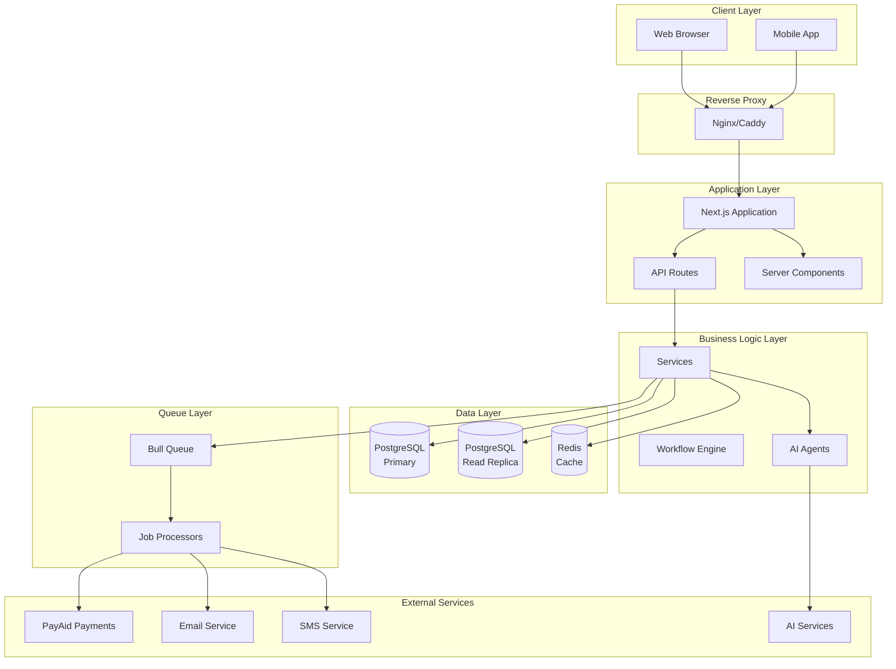
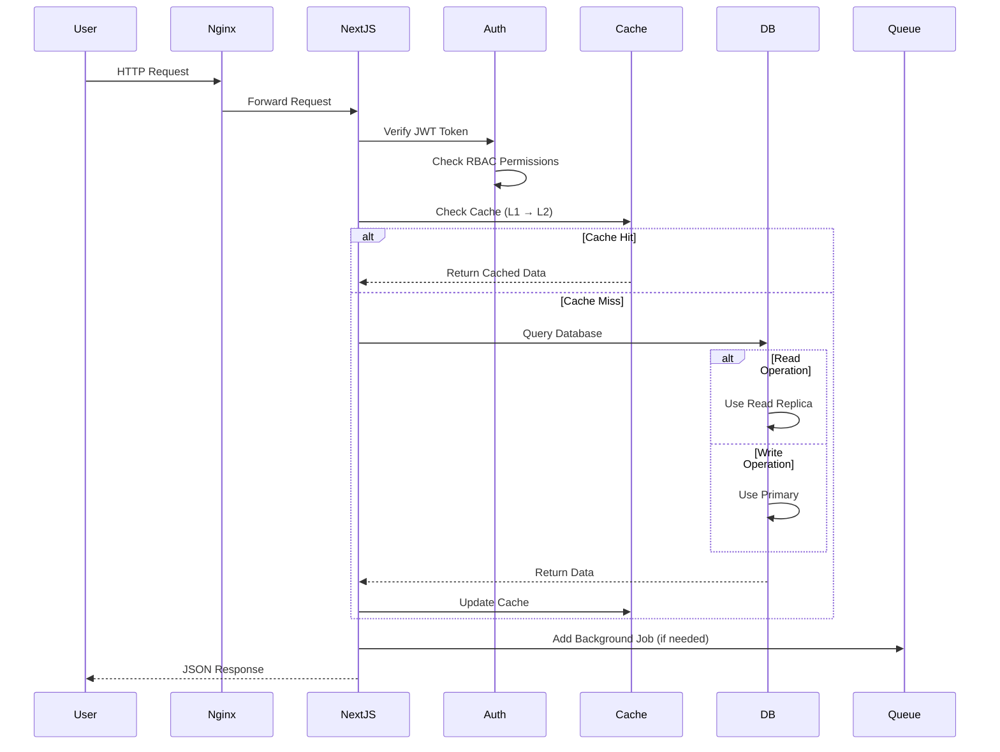

# PayAid V3 - System Architecture & Design

**Version:** 3.0.0  
**Last Updated:** January 2026

---

## 1. High-Level Architecture (Self-Hosted)

### Architecture Diagram



### Architecture Pattern: Monolithic with Modular Organization

PayAid V3 follows a **monolithic architecture** with **modular code organization**. All modules run in a single Next.js application, but code is organized into separate module directories for maintainability.

**Current State:**
- Single Next.js application
- All modules in one codebase
- Shared database (PostgreSQL)
- Shared Redis cache
- Module-based routing (`/dashboard/crm`, `/dashboard/invoicing`)

**Future State (Decoupled):**
- Separate Next.js apps per module
- Subdomain-based routing (`crm.payaid.in`, `finance.payaid.in`)
- Shared authentication (OAuth2 SSO)
- Event-driven sync (Redis pub/sub)
- API Gateway for inter-module communication

### Service-to-Service Communication

**Current (Monolithic):**
- Direct function calls within same process
- Shared database access
- Shared Redis cache

**Future (Decoupled):**
- REST API calls between modules
- GraphQL API (optional, already implemented)
- Event-driven messaging (Redis pub/sub)
- Webhook callbacks

### Data Flow Overview



### External System Integrations

**PayAid Payments (Exclusive):**
- Payment link generation
- Payment status webhooks
- Hash verification
- Encryption support

**No Third-Party Payment Processors:**
- ❌ Razorpay
- ❌ Stripe
- ❌ CCAvenue

### API Gateway Architecture

**Current:**
- Next.js API Routes (`/api/*`)
- Direct route handlers
- No separate gateway layer

**Future:**
- API Gateway for inter-module communication
- Rate limiting per module
- Request routing and load balancing

### Request Flow

```
1. User makes request → Frontend (React/Next.js)
2. Frontend → API Route (`/api/contacts`)
3. Middleware chain:
   - Authentication (JWT verification)
   - Authorization (RBAC check)
   - Rate limiting (Redis)
   - Cache check (Multi-layer)
4. API Handler:
   - Input validation (Zod)
   - Business logic
   - Database query (Prisma)
   - Cache update
5. Response → Frontend
6. Frontend updates UI (React Query)
```

---

## 2. Frontend Architecture

### UI/UX Framework

- **Framework:** Next.js 16.1.0 (App Router)
- **UI Library:** React 19.0.0
- **Styling:** Tailwind CSS 3.4.0
- **Component Library:** Custom components + Lucide React icons
- **Design System:** Custom (no Material-UI or Chakra UI)

### State Management

**Primary:** Zustand 4.5.7
- Global state (user, tenant, theme)
- Module-specific stores
- Persistence (localStorage)

**Data Fetching:** TanStack React Query 5.56.0
- Server state management
- Caching and synchronization
- Optimistic updates
- Background refetching

**Local State:** React useState/useReducer
- Component-specific state
- Form state (React Hook Form)

### Authentication/Authorization on Frontend

**JWT Token Storage:**
- HTTP-only cookies (secure, httpOnly)
- Token in Authorization header for API calls
- Automatic token refresh

**Permission Checks:**
- `usePermission` hook
- `ModuleGate` component (module access check)
- Role-based UI rendering

**Routes:**
- Protected routes: `/dashboard/*`
- Public routes: `/`, `/login`, `/register`
- Middleware: `middleware.ts` (Next.js)

### Real-Time Updates

**Current:**
- Polling for some data (React Query refetchInterval)
- WebSocket support (for voice agents, chat)

**Future:**
- Server-Sent Events (SSE) for notifications
- WebSocket for real-time collaboration

### Responsive Design

- **Mobile-First:** Tailwind CSS breakpoints
- **Breakpoints:**
  - sm: 640px
  - md: 768px
  - lg: 1024px
  - xl: 1280px
  - 2xl: 1536px

### Accessibility

- Semantic HTML
- ARIA labels where needed
- Keyboard navigation support
- Screen reader compatibility (basic)

### Performance Optimization

**Code Splitting:**
- Next.js automatic code splitting
- Dynamic imports for heavy components
- Route-based splitting

**Lazy Loading:**
- Images: Next.js Image component
- Components: React.lazy()
- Routes: Automatic with App Router

**Memoization:**
- React.memo for expensive components
- useMemo for computed values
- useCallback for event handlers

### Offline Capabilities

- **Current:** Limited (basic caching)
- **Future:** Service Worker for offline support

---

## 3. Backend Architecture

### API Design

**Primary:** REST API
- Endpoints: `/api/*`
- HTTP methods: GET, POST, PUT, PATCH, DELETE
- JSON request/response

**Optional:** GraphQL API
- Endpoint: `/api/graphql`
- Schema: `lib/graphql/schema.ts`
- Resolvers: `lib/graphql/resolvers.ts`
- Multi-layer caching integrated
- Read replicas integrated

### Service Layers and Organization

**Structure:**
```
app/api/
├── [module]/
│   ├── route.ts (GET, POST)
│   └── [id]/
│       └── route.ts (GET, PUT, DELETE)
```

**Layers:**
1. **Route Handler** (`app/api/*/route.ts`)
   - Request/response handling
   - Authentication/authorization
   - Input validation

2. **Service Layer** (`lib/services/*`)
   - Business logic
   - Data transformation
   - External API calls

3. **Data Access Layer** (`lib/db/*`)
   - Prisma ORM
   - Database queries
   - Transaction management

### Database Connection Pooling

**Primary Database:**
- Prisma connection pooling (Supabase pooler)
- Connection limit: 100 (default)
- Pool timeout: 10 seconds

**Read Replicas:**
- `prismaRead` client for GET requests
- `DATABASE_READ_URL` environment variable
- Automatic fallback to primary if replica unavailable

### Request Validation and Sanitization

**Validation:**
- Zod schemas for all inputs
- Type-safe validation
- Error messages in response

**Sanitization:**
- HTML escaping (isomorphic-dompurify)
- SQL injection prevention (Prisma parameterized queries)
- XSS protection (React automatic escaping)

### Error Handling and HTTP Status Codes

**Status Codes:**
- 200: Success
- 201: Created
- 400: Bad Request (validation error)
- 401: Unauthorized (authentication failed)
- 403: Forbidden (authorization failed)
- 404: Not Found
- 500: Internal Server Error

**Error Format:**
```json
{
  "error": "Error message",
  "code": "ERROR_CODE",
  "details": {}
}
```

### Logging and Request Tracing

**Logging:**
- Winston/Pino for structured logging
- Log levels: error, warn, info, debug
- Request ID tracking (correlation ID)

**Tracing:**
- Request ID in headers
- Log correlation across services
- Performance timing

### Rate Limiting and Throttling

**Implementation:**
- Redis-based rate limiting
- Tier-based limits:
  - Free: 100 requests/hour
  - Starter: 1000 requests/hour
  - Professional: 10000 requests/hour
  - Enterprise: Unlimited

**Endpoints:**
- `/api/*` - Rate limited
- `/api/auth/*` - Stricter limits (prevent brute force)

### Queue-Based Async Processing

**Queue System:** Bull 4.12.0 (Redis-based)

**Queues:**
- `email` - Email sending
- `sms` - SMS sending
- `reports` - Report generation
- `sync` - Data synchronization
- `cache-warming` - Cache warming

**Job Processors:**
- `lib/jobs/processors.ts`
- Automatic retry with exponential backoff
- Dead letter queue for failed jobs

### Cron Jobs and Scheduled Tasks

**Implementation:**
- Bull scheduler for cron jobs
- Vercel cron jobs (production)
- Scheduled tasks:
  - Cache warming (hourly)
  - Report generation (daily)
  - Email sending (every 5 minutes)
  - Data sync (hourly)

---

## 4. Module Breakdown - Complete List

### A. Authentication & Authorization Module

**Module Name:** `auth`  
**Purpose:** User authentication, authorization, and session management  
**Status:** ✅ Active  
**Dependencies:** Database (User, Tenant), Redis (sessions)

**Frontend Components:**
- `/app/(auth)/login/page.tsx` - Login page
- `/app/(auth)/register/page.tsx` - Registration page
- `/app/(auth)/forgot-password/page.tsx` - Password reset
- `/components/auth/LoginForm.tsx` - Login form
- `/components/auth/RegisterForm.tsx` - Registration form

**Backend Architecture:**
- `/app/api/auth/login/route.ts` - Login endpoint
- `/app/api/auth/register/route.ts` - Registration endpoint
- `/app/api/auth/me/route.ts` - Current user endpoint
- `/lib/auth/jwt.ts` - JWT token management
- `/lib/auth/password.ts` - Password hashing (bcrypt)

**Data Models:**
- `User` - User accounts
- `Tenant` - Organizations/tenants
- `TenantMember` - User-tenant relationships
- `RefreshToken` - Refresh token storage

**API Endpoints:**
- `POST /api/auth/login` - User login
- `POST /api/auth/register` - User registration
- `GET /api/auth/me` - Current user info
- `POST /api/auth/logout` - User logout
- `POST /api/auth/2fa/enable` - Enable 2FA
- `POST /api/auth/2fa/verify` - Verify 2FA

---

### B. Payment Processing Module

**Module Name:** `payments`  
**Purpose:** Payment processing via PayAid Payments gateway  
**Status:** ✅ Active  
**Dependencies:** PayAid Payments API, Invoice module

**Frontend Components:**
- `/app/dashboard/invoices/[id]/page.tsx` - Invoice payment page
- `/components/payments/PaymentLink.tsx` - Payment link component
- `/components/payments/PaymentStatus.tsx` - Payment status display

**Backend Architecture:**
- `/lib/payments/payaid.ts` - PayAid Payments SDK
- `/lib/payments/payaid-hash.ts` - Hash generation/verification
- `/lib/payments/payaid-encryption.ts` - Encryption/decryption
- `/app/api/payments/webhook/route.ts` - Webhook handler
- `/app/api/payments/callback/route.ts` - Payment callback

**Data Models:**
- `Invoice` - Invoices with payment links
- `Order` - Orders with payment processing
- `TenantPaymentSettings` - Payment gateway credentials

**API Endpoints:**
- `POST /api/invoices/[id]/generate-payment-link` - Generate payment link
- `POST /api/invoices/[id]/send-with-payment` - Send invoice with payment
- `POST /api/payments/webhook` - Payment webhook
- `GET /api/payments/callback` - Payment callback

**Payment Flow:**
1. User creates invoice
2. Generate PayAid Payments link
3. Send invoice email with payment link
4. Customer clicks link → PayAid Payments page
5. Customer pays → Webhook received
6. Invoice status updated automatically

---

### C. CRM Module

**Module Name:** `crm`  
**Purpose:** Customer relationship management, leads, deals, pipeline  
**Status:** ✅ Active  
**Dependencies:** Database, Cache, Search

**Frontend Components:**
- `/app/dashboard/contacts/page.tsx` - Contact list
- `/app/dashboard/contacts/[id]/page.tsx` - Contact detail
- `/app/dashboard/deals/page.tsx` - Deal pipeline (Kanban)
- `/app/dashboard/tasks/page.tsx` - Task management
- `/components/crm/ContactList.tsx` - Contact list component
- `/components/crm/DealPipeline.tsx` - Kanban board

**Backend Architecture:**
- `/app/api/contacts/route.ts` - Contact CRUD
- `/app/api/deals/route.ts` - Deal management
- `/app/api/tasks/route.ts` - Task management
- `/crm-module/lib/services/contact-service.ts` - Contact business logic
- `/crm-module/lib/services/deal-service.ts` - Deal business logic

**Data Models:**
- `Contact` - Contacts/leads/customers
- `Deal` - Sales deals/opportunities
- `Task` - Tasks and activities
- `Interaction` - Customer interactions
- `SalesRep` - Sales representatives

**API Endpoints:**
- `GET /api/contacts` - List contacts
- `POST /api/contacts` - Create contact
- `GET /api/contacts/[id]` - Get contact
- `PUT /api/contacts/[id]` - Update contact
- `DELETE /api/contacts/[id]` - Delete contact
- `GET /api/deals` - List deals
- `POST /api/deals` - Create deal
- `GET /api/tasks` - List tasks
- `POST /api/tasks` - Create task

---

### D. Business Automation & Workflow Module

**Module Name:** `workflow`  
**Purpose:** Visual workflow builder, automation, triggers  
**Status:** ✅ Active  
**Dependencies:** All modules (can trigger actions across modules)

**Frontend Components:**
- `/app/dashboard/workflows/page.tsx` - Workflow list
- `/app/dashboard/workflows/[id]/page.tsx` - Workflow builder
- `/components/workflow/WorkflowBuilder.tsx` - Visual builder
- `/components/workflow/TriggerSelector.tsx` - Trigger selection

**Backend Architecture:**
- `/app/api/workflows/route.ts` - Workflow CRUD
- `/app/api/workflows/[id]/execute/route.ts` - Execute workflow
- `/lib/workflow/engine.ts` - Workflow execution engine
- `/lib/workflow/triggers.ts` - Trigger handlers
- `/lib/workflow/actions.ts` - Action handlers

**Data Models:**
- `Workflow` - Workflow definitions
- `WorkflowExecution` - Execution history
- `WorkflowTrigger` - Trigger configurations
- `WorkflowAction` - Action configurations

**API Endpoints:**
- `GET /api/workflows` - List workflows
- `POST /api/workflows` - Create workflow
- `PUT /api/workflows/[id]` - Update workflow
- `POST /api/workflows/[id]/execute` - Execute workflow
- `GET /api/workflows/[id]/executions` - Execution history

**Workflow Types:**
- Time-based (scheduled)
- Event-based (contact created, invoice paid)
- Manual (user-triggered)

**Actions:**
- Send email
- Send SMS
- Create contact
- Create deal
- Create task
- Update contact
- Webhook call

---

### E. AI Agent Orchestration Module

**Module Name:** `ai-cofounder`  
**Purpose:** Multi-agent AI system for business intelligence  
**Status:** ✅ Active  
**Dependencies:** AI services (Groq, Ollama), Database

**Frontend Components:**
- `/app/dashboard/cofounder/page.tsx` - AI Co-Founder chat
- `/components/ai/AgentSelector.tsx` - Agent selection
- `/components/ai/ChatInterface.tsx` - Chat UI

**Backend Architecture:**
- `/app/api/ai/cofounder/route.ts` - Agent router API
- `/lib/ai/agents.ts` - Agent definitions (27+ agents)
- `/lib/ai/business-context-builder.ts` - Context building
- `/lib/ai/services.ts` - AI service integration

**Data Models:**
- `AICofounderConversation` - Conversation history
- `AIUsage` - AI usage tracking

**API Endpoints:**
- `POST /api/ai/cofounder` - Chat with AI agent
- `GET /api/ai/cofounder/conversations` - Conversation history
- `GET /api/ai/cofounder/conversations/[id]` - Get conversation

**Agents (27+):**
1. Co-Founder (orchestrator)
2. CFO (Finance)
3. Sales Agent
4. Marketing Agent
5. HR Agent
6. Website Agent
7. Restaurant Advisor
8. Retail Advisor
9. Manufacturing Advisor
10. Growth Strategist
11. Operations Manager
12. Product Manager
13. Industry Expert
14. Analytics Manager
15. Customer Success
16. Compliance Manager
17. Fundraising Manager
18. Market Researcher
19. Scaling Manager
20. Tech Advisor
21. Design Manager
22. Documentation Manager
23. Email Parser Agent
24. Form Filler Agent
25. Document Reviewer Agent
26. (Additional agents...)

---

### F. Notification Module

**Module Name:** `notifications`  
**Purpose:** Email, SMS, WhatsApp, in-app notifications  
**Status:** ✅ Active  
**Dependencies:** Email service, SMS service, WhatsApp service

**Frontend Components:**
- `/app/dashboard/notifications/page.tsx` - Notification center
- `/components/notifications/NotificationBell.tsx` - Notification bell
- `/components/notifications/NotificationList.tsx` - Notification list

**Backend Architecture:**
- `/app/api/notifications/route.ts` - Notification CRUD
- `/lib/email/service.ts` - Email service
- `/lib/sms/service.ts` - SMS service
- `/lib/whatsapp/service.ts` - WhatsApp service
- `/lib/jobs/processors.ts` - Notification queue processors

**Data Models:**
- `Notification` - In-app notifications
- `EmailTemplate` - Email templates
- `SMSTemplate` - SMS templates
- `WhatsappTemplate` - WhatsApp templates

**API Endpoints:**
- `GET /api/notifications` - List notifications
- `POST /api/notifications/mark-read` - Mark as read
- `POST /api/email/send` - Send email
- `POST /api/sms/send` - Send SMS

**Notification Channels:**
- Email (SendGrid, Gmail SMTP)
- SMS (Twilio, Exotel, Wati)
- WhatsApp (WAHA self-hosted)
- In-app notifications

---

### G. Reporting & Analytics Module

**Module Name:** `analytics`  
**Purpose:** Dashboards, reports, data visualization  
**Status:** ✅ Active  
**Dependencies:** All modules (aggregates data)

**Frontend Components:**
- `/app/dashboard/analytics/page.tsx` - Analytics dashboard
- `/app/dashboard/reports/page.tsx` - Report list
- `/components/analytics/Dashboard.tsx` - Dashboard component
- `/components/analytics/Chart.tsx` - Chart components (Recharts)

**Backend Architecture:**
- `/app/api/analytics/dashboard/stats/route.ts` - Dashboard stats
- `/app/api/reports/route.ts` - Report CRUD
- `/lib/analytics/aggregator.ts` - Data aggregation
- `/lib/reports/generator.ts` - Report generation

**Data Models:**
- `CustomDashboard` - Custom dashboards
- `CustomReport` - Custom reports
- `ReportTemplate` - Report templates

**API Endpoints:**
- `GET /api/analytics/dashboard/stats` - Dashboard statistics
- `GET /api/reports` - List reports
- `POST /api/reports` - Create report
- `GET /api/reports/[id]/execute` - Execute report
- `GET /api/reports/[id]/export` - Export report (PDF/Excel)

**Report Types:**
- Sales reports
- Financial reports
- HR reports
- Custom reports

---

### H. Admin & Settings Module

**Module Name:** `admin`  
**Purpose:** System administration, tenant management, settings  
**Status:** ✅ Active  
**Dependencies:** Database, All modules

**Frontend Components:**
- `/app/dashboard/admin/tenants/page.tsx` - Tenant management
- `/app/dashboard/settings/page.tsx` - Settings page
- `/app/dashboard/settings/tenant/page.tsx` - Tenant settings
- `/components/admin/TenantList.tsx` - Tenant list

**Backend Architecture:**
- `/app/api/admin/tenants/route.ts` - Tenant management
- `/app/api/settings/tenant/route.ts` - Tenant settings
- `/lib/admin/tenant-service.ts` - Tenant business logic

**Data Models:**
- `Tenant` - Organizations/tenants
- `FeatureToggle` - Feature flags
- `ApiKey` - API key management
- `AuditLog` - Audit logging

**API Endpoints:**
- `GET /api/admin/tenants` - List tenants
- `POST /api/admin/tenants` - Create tenant
- `PUT /api/admin/tenants/[id]` - Update tenant
- `GET /api/settings/tenant` - Get tenant settings
- `PUT /api/settings/tenant` - Update tenant settings

---

### I. Integration Hub Module

**Module Name:** `integrations`  
**Purpose:** Third-party API connectors, webhooks  
**Status:** ✅ Active  
**Dependencies:** Webhook handling, API clients

**Frontend Components:**
- `/app/dashboard/integrations/page.tsx` - Integration list
- `/components/integrations/WebhookManager.tsx` - Webhook management

**Backend Architecture:**
- `/app/api/webhooks/route.ts` - Webhook management
- `/app/api/webhooks/[id]/test/route.ts` - Test webhook
- `/lib/integrations/webhook-handler.ts` - Webhook processing

**Data Models:**
- `Webhook` - Webhook configurations
- `OAuthIntegration` - OAuth integrations

**API Endpoints:**
- `GET /api/webhooks` - List webhooks
- `POST /api/webhooks` - Create webhook
- `POST /api/webhooks/[id]/test` - Test webhook

---

### J. Additional Modules

**Invoicing Module** (`invoicing`)
- Invoice creation, management
- GST calculation
- Payment link generation

**HR Module** (`hr`)
- Employee management
- Payroll, attendance, leave
- Hiring and onboarding

**Marketing Module** (`marketing`)
- Email campaigns
- Social media management
- WhatsApp marketing

**Accounting Module** (`accounting`)
- Chart of accounts
- Journal entries
- Financial reports

**Analytics Module** (`analytics`)
- Business intelligence
- Custom dashboards
- Data visualization

**AI Studio Module** (`ai-studio`)
- AI agent configuration
- Knowledge base management
- AI model settings

**Communication Module** (`communication`)
- Email accounts
- SMS management
- Communication history

**WhatsApp Module** (`whatsapp`)
- WhatsApp Business API
- Conversation management
- Template management

---

## 5. Data Models - Key Entities

### Core Entities

**Tenant (Organization)**
- `id`, `name`, `subdomain`, `domain`
- `plan`, `status`, `industry`
- `licensedModules[]`, `subscriptionTier`
- `maxContacts`, `maxInvoices`, `maxUsers`

**User**
- `id`, `email`, `name`, `password` (hashed)
- `role`, `tenantId`, `twoFactorEnabled`
- `emailVerified`, `lastLoginAt`

**Contact**
- `id`, `name`, `email`, `phone`, `company`
- `stage` (prospect, contact, customer)
- `leadScore`, `assignedToId`, `tenantId`

**Deal**
- `id`, `name`, `value`, `stage`
- `contactId`, `assignedToId`, `tenantId`
- `probability`, `expectedCloseDate`

**Invoice**
- `id`, `invoiceNumber`, `amount`, `taxAmount`
- `status`, `paymentStatus`, `customerId`
- `dueDate`, `tenantId`

**Order**
- `id`, `orderNumber`, `total`, `status`
- `customerId`, `paymentMethod`, `tenantId`

### Relationships

- **Tenant → User** (One-to-Many)
- **Tenant → Contact** (One-to-Many)
- **Contact → Deal** (One-to-Many)
- **Contact → Invoice** (One-to-Many)
- **Contact → Order** (One-to-Many)
- **User → Task** (One-to-Many, assigned tasks)

### Indexes

**Performance Indexes:**
- `@@index([tenantId])` - All tenant-scoped tables
- `@@index([tenantId, status])` - Status filtering
- `@@index([tenantId, createdAt])` - Time-based queries
- `@@index([tenantId, leadScore])` - Lead scoring queries

---

## Summary

PayAid V3 uses a monolithic architecture with modular code organization. The system is designed for self-hosted deployment with PostgreSQL, Redis, and Next.js. All modules are integrated into a single application with shared authentication, authorization, and data access layers.

**Key Architecture Decisions:**
- Monolithic for simplicity (can decouple later)
- Multi-layer caching (Memory + Redis)
- Read replicas for scaling reads
- Module-based code organization
- REST API primary, GraphQL optional
- Queue-based async processing
- JWT-based authentication
- RBAC for authorization
