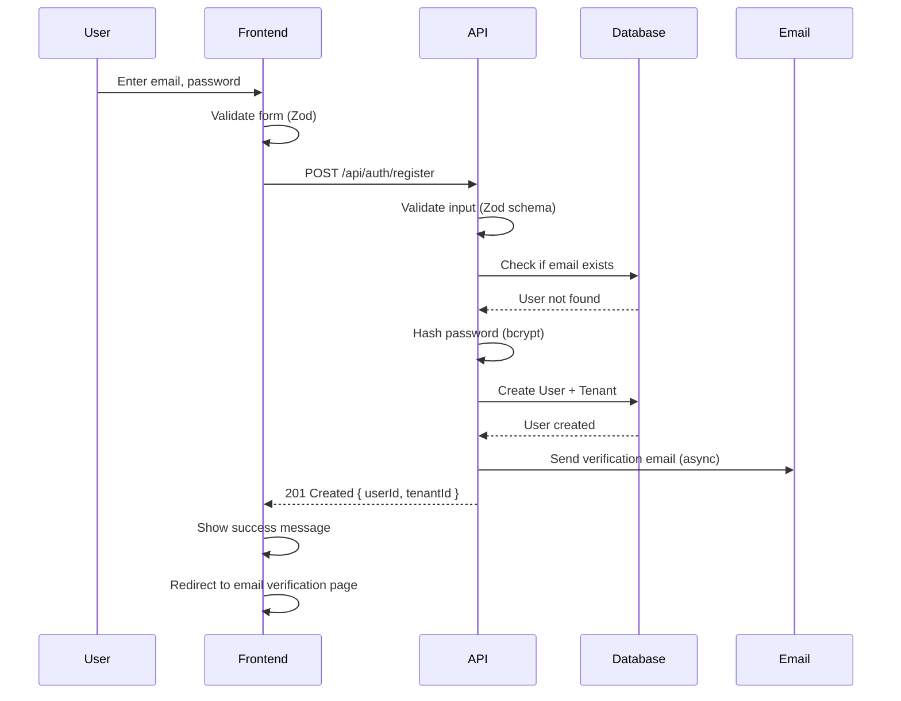
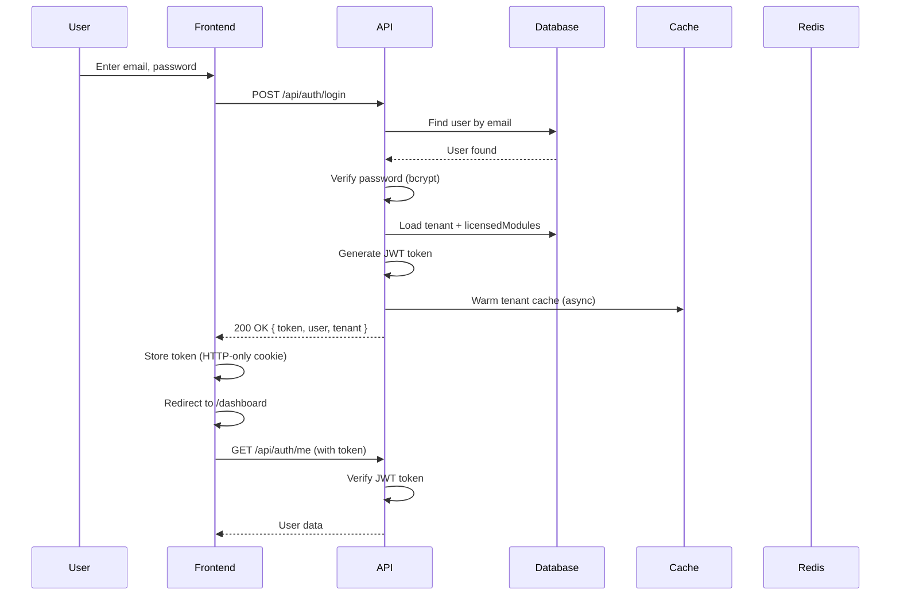
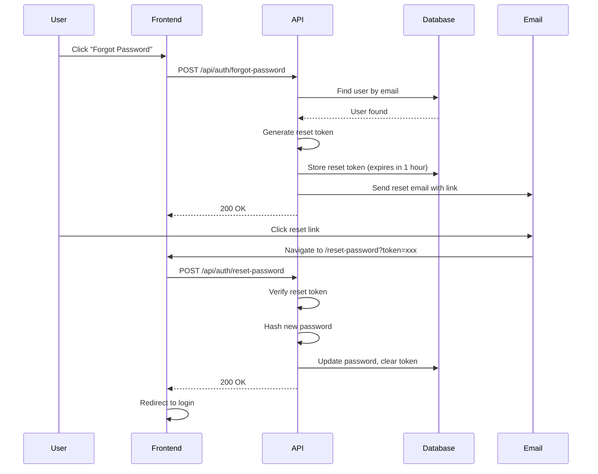
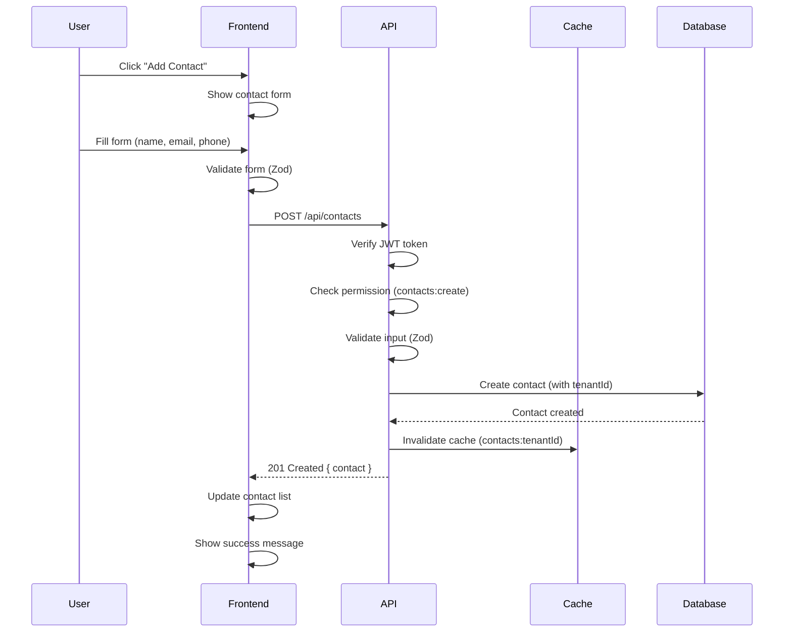
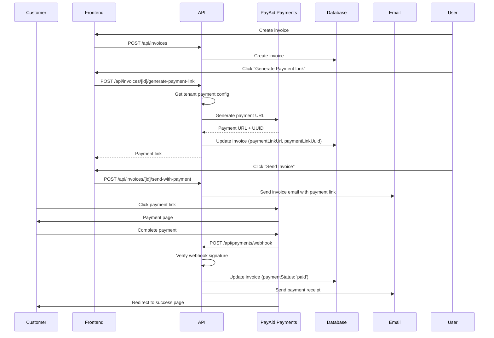
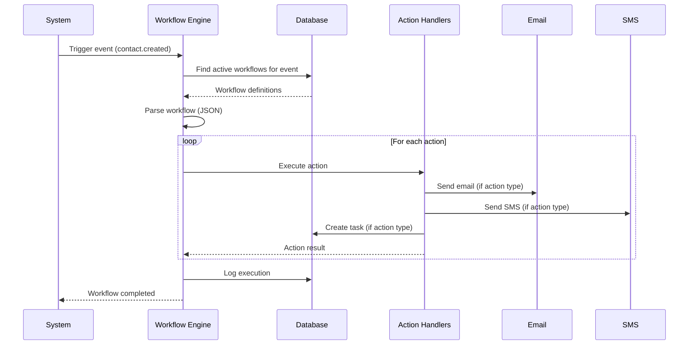
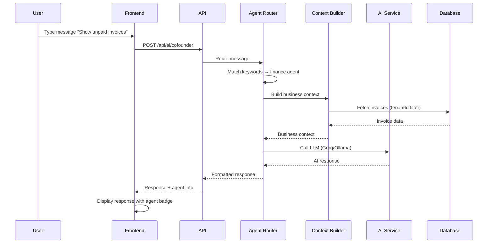
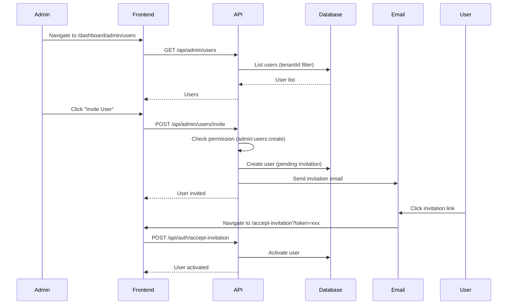
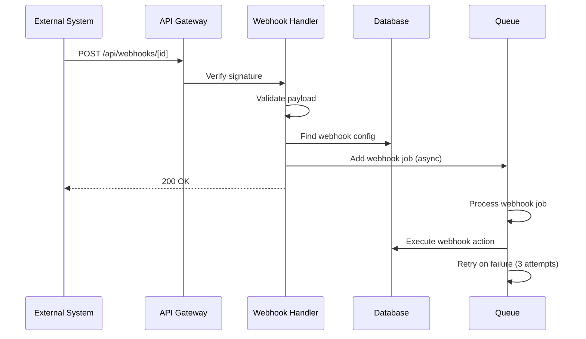

# PayAid V3 - User Flows & Workflows

**Version:** 3.0.0  
**Last Updated:** January 2026

---

## 1. Authentication Flows

### User Registration Flow



**Frontend Flow:**
1. User navigates to `/register`
2. Fills registration form (`components/auth/RegisterForm.tsx`)
3. Form validation (email format, password strength)
4. Submit → `POST /api/auth/register`
5. Show success message
6. Redirect to email verification page

**Backend Flow:**
```typescript
// app/api/auth/register/route.ts
export async function POST(request: NextRequest) {
  // 1. Parse and validate request body
  const body = await request.json()
  const validated = registerSchema.parse(body) // Zod validation
  
  // 2. Check if email already exists
  const existingUser = await prisma.user.findUnique({
    where: { email: validated.email.toLowerCase() }
  })
  if (existingUser) {
    return NextResponse.json(
      { error: 'Email already registered' },
      { status: 400 }
    )
  }
  
  // 3. Hash password
  const hashedPassword = await hashPassword(validated.password)
  
  // 4. Create tenant and user
  const tenant = await prisma.tenant.create({
    data: {
      name: validated.companyName || 'My Company',
      plan: 'free',
      subscriptionTier: 'free',
      users: {
        create: {
          email: validated.email.toLowerCase(),
          password: hashedPassword,
          name: validated.name,
          role: 'OWNER', // First user is owner
        }
      }
    }
  })
  
  // 5. Send verification email (async, non-blocking)
  emailQueue.add('send-verification-email', {
    email: validated.email,
    userId: tenant.users[0].id,
  })
  
  // 6. Return success
  return NextResponse.json({
    userId: tenant.users[0].id,
    tenantId: tenant.id,
    message: 'Registration successful. Please check your email.'
  }, { status: 201 })
}
```

---

### Login/Logout Flow



**Frontend Flow:**
1. User navigates to `/login`
2. Fills login form (`components/auth/LoginForm.tsx`)
3. Submit → `POST /api/auth/login`
4. Receive JWT token
5. Store token in HTTP-only cookie
6. Redirect to `/dashboard`
7. Load user data → `GET /api/auth/me`

**Backend Flow:**
```typescript
// app/api/auth/login/route.ts
export async function POST(request: NextRequest) {
  // 1. Parse and validate request body
  const body = await request.json()
  const validated = loginSchema.parse(body) // { email, password }
  
  // 2. Find user in database
  const user = await prisma.user.findUnique({
    where: { email: validated.email.toLowerCase().trim() },
    include: {
      tenant: {
        select: {
          id: true,
          name: true,
          licensedModules: true,
          subscriptionTier: true,
        }
      }
    }
  })
  
  if (!user) {
    return NextResponse.json(
      { error: 'Invalid email or password' },
      { status: 401 }
    )
  }
  
  // 3. Verify password
  const isValid = await verifyPassword(validated.password, user.password)
  if (!isValid) {
    return NextResponse.json(
      { error: 'Invalid email or password' },
      { status: 401 }
    )
  }
  
  // 4. Generate JWT token
  const token = signToken({
    userId: user.id,
    tenantId: user.tenantId,
    email: user.email,
    role: user.role,
    licensedModules: user.tenant.licensedModules,
    subscriptionTier: user.tenant.subscriptionTier,
  })
  
  // 5. Warm cache (async, non-blocking)
  warmTenantCache(user.tenantId).catch(console.error)
  
  // 6. Update last login
  await prisma.user.update({
    where: { id: user.id },
    data: { lastLoginAt: new Date() }
  })
  
  // 7. Return token and user data
  return NextResponse.json({
    token,
    user: {
      id: user.id,
      email: user.email,
      name: user.name,
      role: user.role,
    },
    tenant: {
      id: user.tenant.id,
      name: user.tenant.name,
      licensedModules: user.tenant.licensedModules,
    }
  })
}
```

**Logout Flow:**
```typescript
// app/api/auth/logout/route.ts
export async function POST(request: NextRequest) {
  // Clear HTTP-only cookie
  const response = NextResponse.json({ message: 'Logged out' })
  response.cookies.delete('token')
  return response
}
```

---

### Password Reset Flow



**Code Example:**
```typescript
// app/api/auth/forgot-password/route.ts
export async function POST(request: NextRequest) {
  const { email } = await request.json()
  
  const user = await prisma.user.findUnique({
    where: { email: email.toLowerCase() }
  })
  
  if (!user) {
    // Don't reveal if email exists (security)
    return NextResponse.json({ message: 'If email exists, reset link sent' })
  }
  
  // Generate reset token
  const resetToken = crypto.randomBytes(32).toString('hex')
  const resetTokenExpiry = new Date(Date.now() + 3600000) // 1 hour
  
  await prisma.user.update({
    where: { id: user.id },
    data: {
      resetToken,
      resetTokenExpiry,
    }
  })
  
  // Send reset email
  await emailQueue.add('send-password-reset', {
    email: user.email,
    resetLink: `${process.env.APP_URL}/reset-password?token=${resetToken}`,
  })
  
  return NextResponse.json({ message: 'Reset link sent' })
}
```

---

### Session Management

**Token Expiry:**
- Access token: 24 hours (configurable via `JWT_EXPIRES_IN`)
- Refresh token: 30 days (future implementation)

**Token Refresh Flow:**
```typescript
// Future implementation
export async function POST(request: NextRequest) {
  const { refreshToken } = await request.json()
  
  // Verify refresh token
  const payload = verifyRefreshToken(refreshToken)
  
  // Generate new access token
  const newToken = signToken({
    userId: payload.userId,
    tenantId: payload.tenantId,
    // ... other claims
  })
  
  return NextResponse.json({ token: newToken })
}
```

---

## 2. Core Business Flows

### Customer Creation Flow



**Frontend Code:**
```typescript
// components/crm/ContactForm.tsx
export function ContactForm() {
  const { mutate: createContact } = useMutation({
    mutationFn: async (data: ContactFormData) => {
      const response = await fetch('/api/contacts', {
        method: 'POST',
        headers: {
          'Content-Type': 'application/json',
          'Authorization': `Bearer ${token}`,
        },
        body: JSON.stringify(data),
      })
      if (!response.ok) throw new Error('Failed to create contact')
      return response.json()
    },
    onSuccess: () => {
      queryClient.invalidateQueries(['contacts'])
      toast.success('Contact created successfully')
    },
  })
  
  return (
    <form onSubmit={handleSubmit((data) => createContact(data))}>
      {/* Form fields */}
    </form>
  )
}
```

**Backend Code:**
```typescript
// app/api/contacts/route.ts
export async function POST(request: NextRequest) {
  // 1. Authenticate and authorize
  const { userId, tenantId } = await requireAuth(request)
  await requirePermission(request, 'contacts:create')
  
  // 2. Validate input
  const body = await request.json()
  const validated = contactSchema.parse(body)
  
  // 3. Create contact
  const contact = await prisma.contact.create({
    data: {
      ...validated,
      tenantId, // Always filter by tenant
      createdAt: new Date(),
    }
  })
  
  // 4. Invalidate cache
  await multiLayerCache.delete(`contacts:${tenantId}`)
  
  // 5. Return created contact
  return NextResponse.json(contact, { status: 201 })
}
```

---

### Payment Initiation Flow



**Code Example - Generate Payment Link:**
```typescript
// app/api/invoices/[id]/generate-payment-link/route.ts
export async function POST(
  request: NextRequest,
  { params }: { params: Promise<{ id: string }> }
) {
  const { tenantId } = await requireModuleAccess(request, 'finance')
  const { id } = await params
  
  // Get invoice
  const invoice = await prisma.invoice.findFirst({
    where: { id, tenantId },
    include: { customer: true }
  })
  
  if (!invoice) {
    return NextResponse.json({ error: 'Invoice not found' }, { status: 404 })
  }
  
  // Get tenant payment config
  const paymentConfig = await getTenantPayAidConfig(tenantId)
  if (!paymentConfig) {
    return NextResponse.json(
      { error: 'Payment gateway not configured' },
      { status: 400 }
    )
  }
  
  // Generate payment link via PayAid Payments
  const payaidPayments = createPayAidPayments(paymentConfig)
  const paymentUrlResponse = await payaidPayments.getPaymentRequestUrl({
    order_id: invoice.invoiceNumber,
    amount: invoice.total,
    currency: 'INR',
    description: `Payment for Invoice ${invoice.invoiceNumber}`,
    name: invoice.customer.name,
    email: invoice.customer.email,
    phone: invoice.customer.phone,
    return_url: `${baseUrl}/api/payments/callback/success?invoice_id=${invoice.id}`,
    return_url_failure: `${baseUrl}/api/payments/callback/failure?invoice_id=${invoice.id}`,
    return_url_cancel: `${baseUrl}/api/payments/callback/cancel?invoice_id=${invoice.id}`,
    mode: process.env.NODE_ENV === 'production' ? 'LIVE' : 'TEST',
    expiry_in_minutes: 10080, // 7 days
    udf1: invoice.id, // Store invoice ID
    udf2: tenantId, // Store tenant ID
  })
  
  // Update invoice
  await prisma.invoice.update({
    where: { id: invoice.id },
    data: {
      paymentLinkUrl: paymentUrlResponse.url,
      paymentLinkUuid: paymentUrlResponse.uuid,
      paymentLinkExpiry: new Date(paymentUrlResponse.expiry_datetime),
      paymentStatus: 'pending',
    }
  })
  
  return NextResponse.json({
    paymentLinkUrl: paymentUrlResponse.url,
    uuid: paymentUrlResponse.uuid,
    expiryDatetime: paymentUrlResponse.expiry_datetime,
  })
}
```

**Code Example - Webhook Handler:**
```typescript
// app/api/payments/webhook/route.ts
export async function POST(request: NextRequest) {
  const body = await request.json()
  
  // Extract invoice ID from UDF fields
  const invoiceId = body.udf1
  const tenantId = body.udf2
  const transactionId = body.transaction_id
  const responseCode = body.response_code
  
  // Find invoice
  const invoice = await prisma.invoice.findFirst({
    where: { id: invoiceId, tenantId }
  })
  
  if (!invoice) {
    return NextResponse.json({ error: 'Invoice not found' }, { status: 404 })
  }
  
  // Verify webhook signature
  const paymentConfig = await getTenantPayAidConfig(tenantId)
  const payaidPayments = createPayAidPayments(paymentConfig)
  if (!payaidPayments.verifyWebhookSignature(body)) {
    return NextResponse.json({ error: 'Invalid signature' }, { status: 401 })
  }
  
  // Determine payment status
  let paymentStatus = 'pending'
  if (responseCode === 0) {
    paymentStatus = 'paid'
  } else if (responseCode === 1043) {
    paymentStatus = 'cancelled'
  } else {
    paymentStatus = 'failed'
  }
  
  // Update invoice
  await prisma.invoice.update({
    where: { id: invoice.id },
    data: {
      paymentTransactionId: transactionId,
      paymentStatus,
      paymentMode: body.payment_mode,
      paymentChannel: body.payment_channel,
      paymentDatetime: body.payment_datetime ? new Date(body.payment_datetime) : null,
      status: paymentStatus === 'paid' ? 'paid' : invoice.status,
      paidAt: paymentStatus === 'paid' ? new Date() : null,
    }
  })
  
  // Send receipt email (async)
  if (paymentStatus === 'paid') {
    emailQueue.add('send-payment-receipt', {
      invoiceId: invoice.id,
      customerEmail: invoice.customer.email,
    })
  }
  
  return NextResponse.json({ success: true })
}
```

---

### Workflow Automation Execution Flow



**Code Example:**
```typescript
// lib/workflow/engine.ts
export async function executeWorkflow(
  workflowId: string,
  triggerData: Record<string, any>
) {
  const workflow = await prisma.workflow.findUnique({
    where: { id: workflowId }
  })
  
  if (!workflow || !workflow.isActive) {
    return
  }
  
  // Parse workflow definition (JSON)
  const definition = workflow.definition as WorkflowDefinition
  
  // Execute actions sequentially
  for (const action of definition.actions) {
    try {
      await executeAction(action, triggerData)
    } catch (error) {
      // Log error but continue
      await prisma.workflowExecution.create({
        data: {
          workflowId,
          status: 'error',
          error: error.message,
        }
      })
    }
  }
  
  // Log successful execution
  await prisma.workflowExecution.create({
    data: {
      workflowId,
      status: 'completed',
      executedAt: new Date(),
    }
  })
}

async function executeAction(
  action: WorkflowAction,
  triggerData: Record<string, any>
) {
  switch (action.type) {
    case 'send_email':
      await emailQueue.add('send-workflow-email', {
        to: action.config.to,
        subject: action.config.subject,
        body: action.config.body,
      })
      break
      
    case 'send_sms':
      await smsQueue.add('send-workflow-sms', {
        to: action.config.to,
        message: action.config.message,
      })
      break
      
    case 'create_task':
      await prisma.task.create({
        data: {
          title: action.config.title,
          description: action.config.description,
          assignedToId: action.config.assignedToId,
          tenantId: triggerData.tenantId,
        }
      })
      break
      
    case 'create_contact':
      await prisma.contact.create({
        data: {
          name: action.config.name,
          email: action.config.email,
          tenantId: triggerData.tenantId,
        }
      })
      break
  }
}
```

---

### AI Agent Invocation Flow



**Code Example:**
```typescript
// app/api/ai/cofounder/route.ts
export async function POST(request: NextRequest) {
  const { userId, tenantId } = await requireAuth(request)
  const { message, agentId } = await request.json()
  
  // Route to appropriate agent
  const selectedAgentId = agentId || routeToAgent(message)
  const agent = getAgent(selectedAgentId)
  
  // Build business context
  const context = await buildBusinessContext(tenantId, agent.dataScopes)
  
  // Call AI service
  const aiResponse = await callAIService({
    message,
    systemPrompt: agent.systemPrompt,
    context,
    model: 'groq-llama-3.1-70b', // Primary
    fallback: 'ollama-mistral', // Fallback
  })
  
  // Save conversation
  await prisma.aICofounderConversation.create({
    data: {
      userId,
      tenantId,
      message,
      response: aiResponse,
      agentId: selectedAgentId,
    }
  })
  
  return NextResponse.json({
    message: aiResponse,
    agent: {
      id: agent.id,
      name: agent.name,
      description: agent.description,
    }
  })
}
```

---

## 3. Admin Workflows

### Organization/User Management Flow



---

## 4. Integration Workflows

### Webhook Processing Flow



**Code Example:**
```typescript
// app/api/webhooks/[id]/route.ts
export async function POST(
  request: NextRequest,
  { params }: { params: Promise<{ id: string }> }
) {
  const { id } = await params
  const body = await request.json()
  
  // Find webhook configuration
  const webhook = await prisma.webhook.findUnique({
    where: { id }
  })
  
  if (!webhook || !webhook.isActive) {
    return NextResponse.json({ error: 'Webhook not found' }, { status: 404 })
  }
  
  // Verify webhook signature
  const signature = request.headers.get('x-webhook-signature')
  if (!verifyWebhookSignature(body, signature, webhook.secret)) {
    return NextResponse.json({ error: 'Invalid signature' }, { status: 401 })
  }
  
  // Process webhook asynchronously
  await webhookQueue.add('process-webhook', {
    webhookId: id,
    payload: body,
    tenantId: webhook.tenantId,
  })
  
  return NextResponse.json({ success: true })
}
```

---

## Summary

PayAid V3 implements comprehensive user flows for authentication, core business operations, admin management, and integrations. All flows include proper authentication, authorization, validation, error handling, and async processing where appropriate.

**Key Flow Characteristics:**
- ✅ Authentication required for all protected routes
- ✅ Authorization checks (RBAC) before operations
- ✅ Input validation (Zod schemas)
- ✅ Tenant isolation (all queries filter by tenantId)
- ✅ Cache invalidation on writes
- ✅ Async processing for emails, SMS, webhooks
- ✅ Error handling and logging
- ✅ Webhook signature verification
