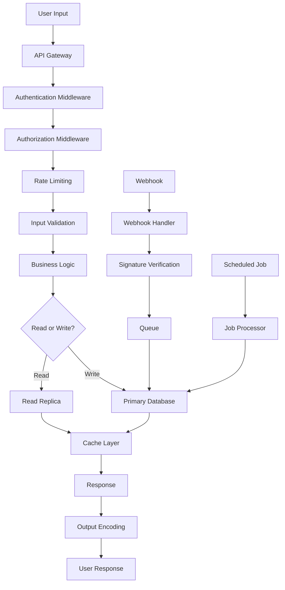

# PayAid V3 - Data Flow & Security

**Version:** 3.0.0  
**Last Updated:** January 2026

---

## 1. End-to-End Data Flow

### Data Flow Diagram



### Data Entry Points

1. **API Requests** (`/api/*`)
   - User-initiated actions
   - Authenticated requests
   - Validated inputs

2. **Webhooks** (`/api/webhooks/*`, `/api/payments/webhook`)
   - External system callbacks
   - PayAid Payments webhooks
   - Signature verification required

3. **File Uploads** (`/api/drive/upload`)
   - Document uploads
   - Image uploads
   - Validated file types and sizes

4. **Scheduled Tasks** (Cron jobs)
   - Cache warming
   - Report generation
   - Data synchronization

### Transformation Pipeline

**Input Validation:**
```typescript
// Example: Contact creation validation
const contactSchema = z.object({
  name: z.string().min(1).max(255),
  email: z.string().email().optional(),
  phone: z.string().regex(/^[0-9]{10}$/).optional(),
  company: z.string().max(255).optional(),
})

// Sanitization
const sanitized = {
  name: DOMPurify.sanitize(input.name),
  email: input.email?.toLowerCase().trim(),
  phone: input.phone?.replace(/\D/g, ''), // Remove non-digits
}
```

**Data Normalization:**
- Email: lowercase, trim
- Phone: remove formatting, store digits only
- Dates: convert to UTC
- Currency: store as Decimal (PostgreSQL)

**Enrichment:**
- Lead scoring (automatic)
- Address geocoding (future)
- Email domain validation
- GSTIN validation

### Storage Layers

**Primary Database (PostgreSQL):**
- All persistent data
- ACID transactions
- Foreign key constraints
- Indexes for performance

**Cache Layer (Multi-layer):**
- L1: In-memory cache (fast, per-instance)
- L2: Redis cache (fast, distributed)
- Cache keys: `module:tenantId:resourceId`

**File Storage:**
- S3-compatible storage (Minio for self-hosted)
- File metadata in database
- CDN for static assets (future)

### Output/Export Paths

**API Responses:**
- JSON format
- Pagination for lists
- Filtering and sorting
- Field selection (future)

**Reports:**
- PDF generation (PDFKit)
- Excel export (XLSX)
- CSV export (PapaParse)
- Email delivery

**Webhooks:**
- Outgoing webhooks to external systems
- Retry logic (3 attempts)
- Signature signing

### Data Deletion/Archival Policies

**Soft Delete:**
- Most models have `deletedAt` field
- Data retained for audit
- Can be restored

**Hard Delete:**
- After retention period (90 days)
- GDPR compliance
- Complete removal from database

**Archival:**
- Old data moved to archive tables
- Retention: 2 years for invoices, 1 year for contacts

---

## 2. Security Implementation

### Authentication

#### JWT Structure and Payload

```typescript
// lib/auth/jwt.ts
export interface JWTPayload {
  userId: string
  tenantId: string
  email: string
  role: string
  licensedModules?: string[]
  subscriptionTier?: string
  iat: number // Issued at
  exp: number // Expires at
}

// Token generation
const token = jwt.sign(payload, JWT_SECRET, {
  expiresIn: '24h', // Configurable via JWT_EXPIRES_IN
  algorithm: 'HS256',
})
```

**Token Storage:**
- HTTP-only cookies (secure, httpOnly, sameSite: 'strict')
- Not stored in localStorage (XSS protection)
- Sent in Authorization header for API calls

#### Token Expiry and Refresh Logic

**Current:**
- Access token: 24 hours
- Refresh token: Not yet implemented (planned)

**Future Refresh Flow:**
```typescript
// Refresh token implementation (planned)
export async function refreshToken(refreshToken: string) {
  // Verify refresh token
  const payload = verifyRefreshToken(refreshToken)
  
  // Check if refresh token is still valid
  const tokenRecord = await prisma.refreshToken.findUnique({
    where: { token: refreshToken }
  })
  
  if (!tokenRecord || tokenRecord.expiresAt < new Date()) {
    throw new Error('Refresh token expired')
  }
  
  // Generate new access token
  const newAccessToken = signToken({
    userId: payload.userId,
    tenantId: payload.tenantId,
    // ... other claims
  })
  
  return { accessToken: newAccessToken }
}
```

#### Password Hashing Algorithm

**Algorithm:** bcryptjs (bcrypt)
- Cost factor: 10 (configurable)
- Salt: Auto-generated per password
- One-way hashing (cannot be reversed)

```typescript
// lib/auth/password.ts
import bcrypt from 'bcryptjs'

export async function hashPassword(password: string): Promise<string> {
  const saltRounds = 10
  return bcrypt.hash(password, saltRounds)
}

export async function verifyPassword(
  password: string,
  hash: string
): Promise<boolean> {
  return bcrypt.compare(password, hash)
}
```

**Password Requirements:**
- Minimum 8 characters
- At least one uppercase letter
- At least one lowercase letter
- At least one number
- Special characters recommended

#### Session Management

**Current:**
- Stateless (JWT tokens)
- No server-side session storage
- Token expiry handles session timeout

**Future:**
- Session tracking in Redis
- Concurrent session limits
- Session invalidation on password change

---

### Encryption

#### Encryption at Rest

**Database:**
- PostgreSQL encryption (TDE - Transparent Data Encryption)
- File system encryption (LUKS for Linux)
- Backup encryption

**Sensitive Fields:**
- Passwords: Hashed (bcrypt), never encrypted
- API keys: Encrypted before storage
- Payment tokens: Encrypted (AES-256)

```typescript
// lib/security/encryption.ts
import crypto from 'crypto'

const algorithm = 'aes-256-gcm'
const key = Buffer.from(process.env.ENCRYPTION_KEY!, 'hex')

export function encrypt(text: string): string {
  const iv = crypto.randomBytes(16)
  const cipher = crypto.createCipheriv(algorithm, key, iv)
  
  let encrypted = cipher.update(text, 'utf8', 'hex')
  encrypted += cipher.final('hex')
  
  const authTag = cipher.getAuthTag()
  
  return `${iv.toString('hex')}:${authTag.toString('hex')}:${encrypted}`
}

export function decrypt(encryptedText: string): string {
  const [ivHex, authTagHex, encrypted] = encryptedText.split(':')
  const iv = Buffer.from(ivHex, 'hex')
  const authTag = Buffer.from(authTagHex, 'hex')
  
  const decipher = crypto.createDecipheriv(algorithm, key, iv)
  decipher.setAuthTag(authTag)
  
  let decrypted = decipher.update(encrypted, 'hex', 'utf8')
  decrypted += decipher.final('utf8')
  
  return decrypted
}
```

#### Encryption in Transit

**TLS/HTTPS:**
- TLS 1.3 (minimum TLS 1.2)
- Let's Encrypt certificates (free)
- Automatic certificate renewal (Certbot)

**Database Connections:**
- SSL/TLS for PostgreSQL connections
- `sslmode=require` in connection string

**API Communication:**
- HTTPS only (HTTP redirects to HTTPS)
- HSTS header (Strict-Transport-Security)

#### Field-Level Encryption

**Sensitive Data:**
- API keys: Encrypted in `ApiKey` table
- Payment tokens: Encrypted in `PaymentMethod` table
- OAuth tokens: Encrypted in `OAuthIntegration` table

**Implementation:**
```typescript
// Example: API key encryption
const apiKey = generateApiKey()
const encryptedKey = encrypt(apiKey)

await prisma.apiKey.create({
  data: {
    keyHash: hashApiKey(apiKey), // For lookup
    encryptedKey, // For retrieval
    // ...
  }
})
```

---

### Authorization & Access Control

#### API Authentication Methods

**JWT Tokens:**
- Primary method
- Bearer token in Authorization header
- `Authorization: Bearer <token>`

**API Keys:**
- For programmatic access
- Scoped to specific endpoints
- Rate limited per key
- IP whitelisting support

```typescript
// lib/auth/api-key.ts
export async function authenticateApiKey(
  apiKey: string,
  request: NextRequest
): Promise<ApiKeyPayload> {
  // Hash API key for lookup
  const keyHash = hashApiKey(apiKey)
  
  // Find API key
  const keyRecord = await prisma.apiKey.findFirst({
    where: {
      keyHash,
      expiresAt: { gt: new Date() },
      isActive: true,
    },
    include: { tenant: true }
  })
  
  if (!keyRecord) {
    throw new Error('Invalid API key')
  }
  
  // Check IP whitelist
  const clientIp = getClientIp(request)
  if (keyRecord.ipWhitelist.length > 0) {
    if (!isIpWhitelisted(clientIp, keyRecord.ipWhitelist)) {
      throw new Error('IP not whitelisted')
    }
  }
  
  // Check rate limit
  await checkRateLimit(keyRecord.id, keyRecord.rateLimit)
  
  return {
    apiKeyId: keyRecord.id,
    tenantId: keyRecord.orgId,
    scopes: keyRecord.scopes,
  }
}
```

#### Permission Enforcement in Middleware

```typescript
// lib/middleware/auth.ts
export async function requirePermission(
  request: NextRequest,
  permission: string
) {
  const user = await requireAuth(request)
  
  // Check role permissions
  const rolePermissions = await getRolePermissions(user.role)
  if (!rolePermissions.includes(permission)) {
    throw new Error('Forbidden')
  }
  
  // Check module license
  const module = permission.split(':')[0]
  if (!user.licensedModules.includes(module)) {
    throw new Error('Module not licensed')
  }
  
  return user
}
```

#### Row-Level Security

**Tenant Isolation:**
- All queries filter by `tenantId`
- Enforced at application level
- Database-level RLS (future)

```typescript
// Always filter by tenantId
const contacts = await prisma.contact.findMany({
  where: {
    tenantId: user.tenantId, // Always include
    // ... other filters
  }
})
```

**Object-Level Permissions:**
- `assignedToId` filtering for non-admins
- Record ownership checks
- Sharing permissions (future)

---

### Input Validation & Output Encoding

#### SQL Injection Prevention

**Prisma ORM:**
- Parameterized queries (automatic)
- No raw SQL (unless necessary)
- Type-safe queries

```typescript
// ✅ Safe (Prisma)
const contacts = await prisma.contact.findMany({
  where: { tenantId, name: searchTerm }
})

// ❌ Never do this
// const query = `SELECT * FROM contacts WHERE name = '${searchTerm}'`
```

#### XSS Protection

**Frontend:**
- React automatic escaping
- DOMPurify for user-generated content
- Content Security Policy (CSP) headers

```typescript
// components/SafeHtml.tsx
import DOMPurify from 'isomorphic-dompurify'

export function SafeHtml({ html }: { html: string }) {
  const sanitized = DOMPurify.sanitize(html, {
    ALLOWED_TAGS: ['b', 'i', 'em', 'strong', 'a', 'p'],
    ALLOWED_ATTR: ['href'],
  })
  
  return <div dangerouslySetInnerHTML={{ __html: sanitized }} />
}
```

**CSP Headers:**
```typescript
// next.config.js
headers: [
  {
    key: 'Content-Security-Policy',
    value: "default-src 'self'; script-src 'self' 'unsafe-inline'; style-src 'self' 'unsafe-inline';"
  }
]
```

#### CSRF Protection

**SameSite Cookies:**
- `sameSite: 'strict'` for cookies
- Prevents CSRF attacks
- Works with SameSite browser support

**CSRF Tokens (Future):**
- For state-changing operations
- Token in form/header
- Server-side validation

#### File Upload Validation

```typescript
// app/api/drive/upload/route.ts
const MAX_FILE_SIZE = 10 * 1024 * 1024 // 10MB
const ALLOWED_TYPES = ['image/jpeg', 'image/png', 'application/pdf']

export async function POST(request: NextRequest) {
  const formData = await request.formData()
  const file = formData.get('file') as File
  
  // Validate file type
  if (!ALLOWED_TYPES.includes(file.type)) {
    return NextResponse.json(
      { error: 'Invalid file type' },
      { status: 400 }
    )
  }
  
  // Validate file size
  if (file.size > MAX_FILE_SIZE) {
    return NextResponse.json(
      { error: 'File too large' },
      { status: 400 }
    )
  }
  
  // Scan for viruses (future)
  // await virusScanner.scan(file)
  
  // Upload to S3
  const url = await uploadToS3(file)
  
  return NextResponse.json({ url })
}
```

---

### Secrets Management

#### How API Keys and Credentials are Stored

**Environment Variables:**
- `.env.local` (local development)
- `.env.production` (production)
- Never committed to git
- `.env.example` for documentation

**Database (Encrypted):**
- Tenant payment settings (encrypted)
- OAuth tokens (encrypted)
- API keys (hashed + encrypted)

**Key Management:**
- `ENCRYPTION_KEY`: 32-byte hex string
- `JWT_SECRET`: Random string (min 32 chars)
- Rotated periodically

#### Key Rotation Procedures

**JWT Secret Rotation:**
1. Generate new secret
2. Update environment variable
3. Old tokens expire naturally (24h)
4. Users re-authenticate

**Encryption Key Rotation:**
1. Generate new key
2. Re-encrypt all encrypted fields
3. Update environment variable
4. Old key kept for decryption (gradual migration)

#### Access Control to Secrets

**Environment Variables:**
- Only accessible to application
- Not exposed to frontend
- Server-side only

**Database Secrets:**
- Encrypted at rest
- Decrypted only when needed
- Never logged

---

### PCI DSS Compliance

**Payment Card Data:**
- Never store full card numbers
- PayAid Payments handles tokenization
- Only store payment tokens (encrypted)

**Compliance Measures:**
- No card data in logs
- Encrypted payment tokens
- Secure payment gateway integration
- Regular security audits

---

### Data Privacy Compliance

#### India Data Protection (DPDP Act Compliance)

**Data Collection:**
- Consent required for data collection
- Purpose limitation
- Data minimization

**Data Retention:**
- Retention policies per data type
- Automatic deletion after retention period
- User data export/deletion requests

**User Rights:**
- Right to access data
- Right to correction
- Right to deletion
- Right to data portability

**Implementation:**
```typescript
// app/api/data-governance/export/route.ts
export async function GET(request: NextRequest) {
  const { userId, tenantId } = await requireAuth(request)
  
  // Export all user data
  const userData = {
    profile: await prisma.user.findUnique({ where: { id: userId } }),
    contacts: await prisma.contact.findMany({ where: { tenantId } }),
    invoices: await prisma.invoice.findMany({ where: { tenantId } }),
    // ... all user data
  }
  
  return NextResponse.json(userData)
}

// app/api/data-governance/delete/route.ts
export async function DELETE(request: NextRequest) {
  const { userId, tenantId } = await requireAuth(request)
  
  // Soft delete (GDPR compliance)
  await prisma.user.update({
    where: { id: userId },
    data: { deletedAt: new Date() }
  })
  
  // Anonymize related data
  await prisma.contact.updateMany({
    where: { tenantId },
    data: {
      email: null,
      phone: null,
      name: 'Deleted User',
    }
  })
  
  return NextResponse.json({ message: 'Data deleted' })
}
```

---

### Audit & Logging

#### Who Accessed What, When, and From Where

**Audit Log Model:**
```typescript
// prisma/schema.prisma
model AuditLog {
  id             String   @id @default(cuid())
  entityType     String   // 'Contact', 'Invoice', etc.
  entityId       String
  changedBy      String   // User ID
  changeSummary  String
  beforeSnapshot Json?
  afterSnapshot  Json?
  tenantId       String
  ipAddress      String?
  userAgent      String?
  timestamp      DateTime @default(now())
}
```

**Logging Implementation:**
```typescript
// lib/audit/logger.ts
export async function logAuditEvent(
  entityType: string,
  entityId: string,
  action: string,
  userId: string,
  tenantId: string,
  before?: any,
  after?: any,
  request?: NextRequest
) {
  await prisma.auditLog.create({
    data: {
      entityType,
      entityId,
      changedBy: userId,
      changeSummary: action,
      beforeSnapshot: before,
      afterSnapshot: after,
      tenantId,
      ipAddress: request ? getClientIp(request) : null,
      userAgent: request ? request.headers.get('user-agent') : null,
    }
  })
}
```

#### Audit Log Retention and Rotation

- Retention: 2 years
- Rotation: Monthly archive
- Compression: Gzip compression
- Deletion: After retention period

#### Admin Activity Logging

**Logged Actions:**
- User creation/deletion
- Role changes
- Module enablement/disablement
- Settings changes
- Payment gateway configuration

---

### DDoS & Rate Limiting

#### Rate Limiting per IP and per User

**Implementation:**
```typescript
// lib/rate-limit/redis.ts
import { Ratelimit } from '@upstash/ratelimit'
import { Redis } from '@upstash/redis'

const ratelimit = new Ratelimit({
  redis: Redis.fromEnv(),
  limiter: Ratelimit.slidingWindow(100, '1 h'), // 100 requests per hour
  analytics: true,
})

export async function checkRateLimit(
  identifier: string,
  limit: number = 100
): Promise<boolean> {
  const { success } = await ratelimit.limit(identifier)
  return success
}
```

**Tier-Based Limits:**
- Free: 100 requests/hour
- Starter: 1,000 requests/hour
- Professional: 10,000 requests/hour
- Enterprise: Unlimited

#### Distributed Rate Limiting

**Redis-Based:**
- Shared rate limit across instances
- Consistent limits
- Real-time tracking

#### Captcha or Challenge-Response

**Future Implementation:**
- reCAPTCHA for login attempts
- Rate limit exceeded → captcha challenge
- Prevents automated attacks

---

## 3. Multi-Tenancy & Isolation

### Tenant Isolation Strategy

**Row-Level Isolation:**
- All tables have `tenantId` column
- All queries filter by `tenantId`
- Enforced at application level

**Database-Level RLS (Future):**
```sql
-- PostgreSQL Row Level Security (future)
ALTER TABLE contacts ENABLE ROW LEVEL SECURITY;

CREATE POLICY tenant_isolation ON contacts
  FOR ALL
  USING (tenant_id = current_setting('app.tenant_id')::uuid);
```

### Cross-Tenant Data Leak Prevention

**Measures:**
1. Always filter by `tenantId` in queries
2. JWT token includes `tenantId`
3. Middleware validates `tenantId` match
4. No cross-tenant queries allowed

**Code Example:**
```typescript
// ✅ Correct - Always filter by tenantId
const contacts = await prisma.contact.findMany({
  where: { tenantId: user.tenantId }
})

// ❌ Wrong - Missing tenantId filter
const contacts = await prisma.contact.findMany() // SECURITY RISK!
```

### Shared vs. Isolated Resources

**Isolated:**
- Database rows (tenant-scoped)
- File storage (tenant-scoped buckets)
- Cache keys (tenant-prefixed)

**Shared:**
- Application code
- Infrastructure (servers, databases)
- Redis cache (tenant-prefixed keys)

### Backup and Recovery per Tenant

**Backup Strategy:**
- Full database backup (all tenants)
- Tenant-specific restore (filter by tenantId)
- Point-in-time recovery

**Disaster Recovery:**
- RTO: 4 hours
- RPO: 24 hours
- Automated backup testing

### Tenant Data Segregation in Logs and Analytics

**Log Prefixing:**
- All logs include `tenantId`
- Log aggregation by tenant
- Tenant-specific log views

**Analytics:**
- Tenant-scoped dashboards
- Cross-tenant analytics (admin only)
- Data aggregation per tenant

---

## Summary

PayAid V3 implements comprehensive security measures including authentication (JWT), authorization (RBAC), encryption (at rest and in transit), input validation, secrets management, audit logging, rate limiting, and multi-tenant isolation.

**Key Security Features:**
- ✅ JWT-based authentication with 24h expiry
- ✅ RBAC with 6 roles and module-level permissions
- ✅ Encryption at rest (AES-256) and in transit (TLS 1.3)
- ✅ Input validation (Zod) and output encoding
- ✅ SQL injection prevention (Prisma ORM)
- ✅ XSS protection (React + DOMPurify)
- ✅ CSRF protection (SameSite cookies)
- ✅ Rate limiting (Redis-based, tier-based)
- ✅ Multi-tenant isolation (row-level)
- ✅ Audit logging (all actions tracked)
- ✅ GDPR/DPDP Act compliance (data export/deletion)
