# PayAid V3 - Architecture Diagrams

**Version:** 3.0.0  
**Last Updated:** January 2026

---

## System Architecture Diagram

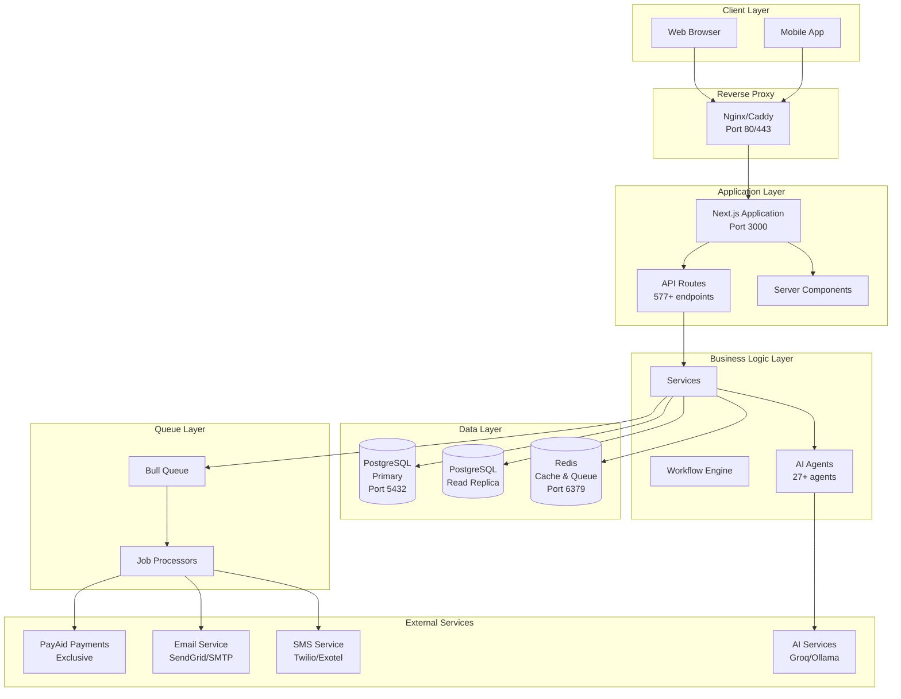

---

## Multi-Tenant Architecture

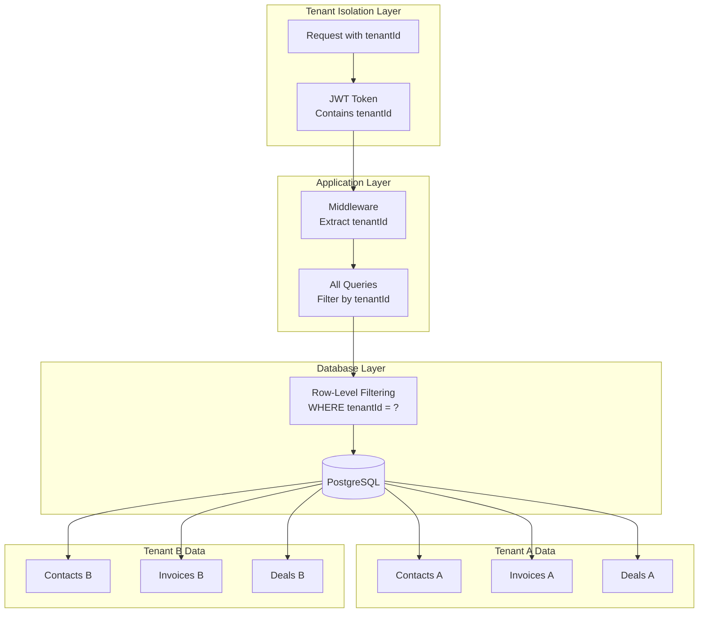

---

## Authentication & Authorization Flow

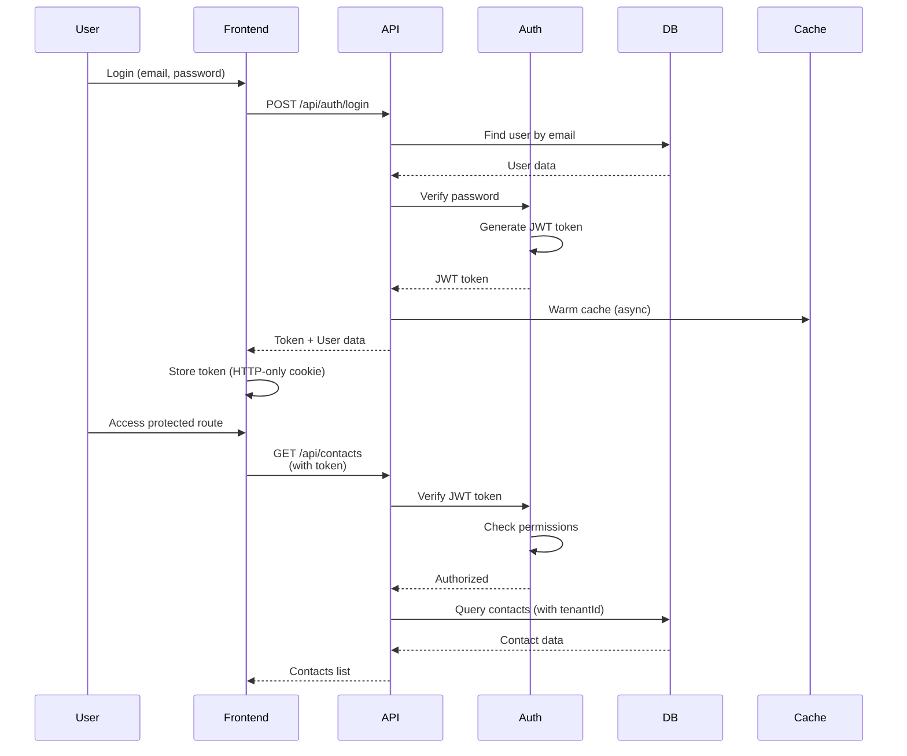

---

## Payment Processing Flow

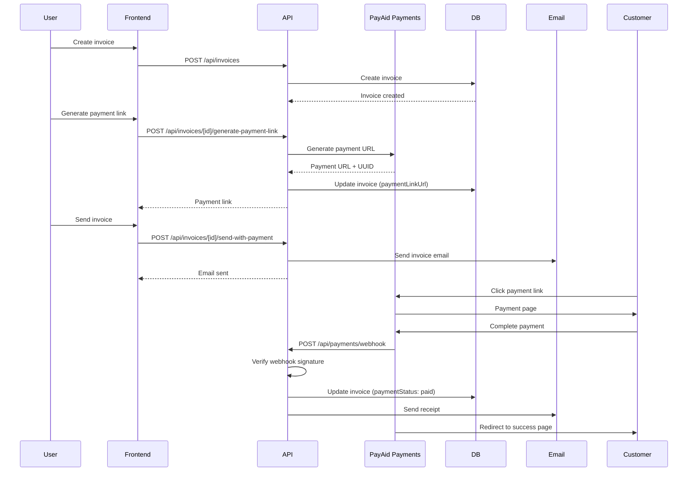

---

## Caching Architecture (Multi-Layer)

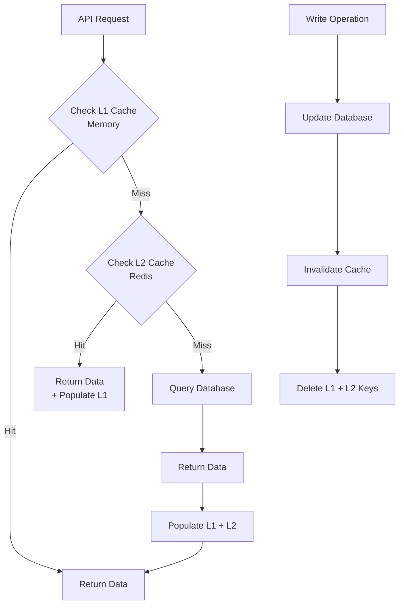

---

## AI Agent System Architecture

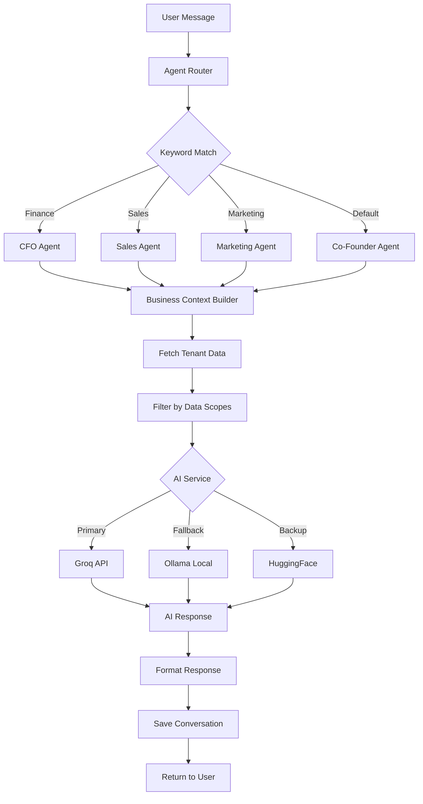

---

## Module Architecture

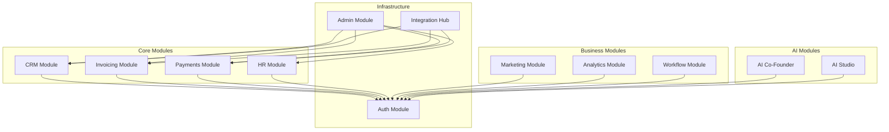

---

## Database Schema Relationships

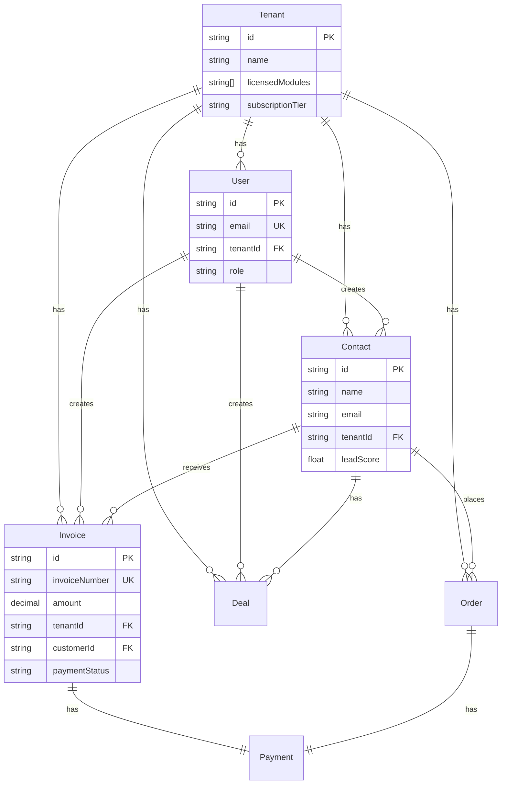

---

## Deployment Architecture (Self-Hosted)

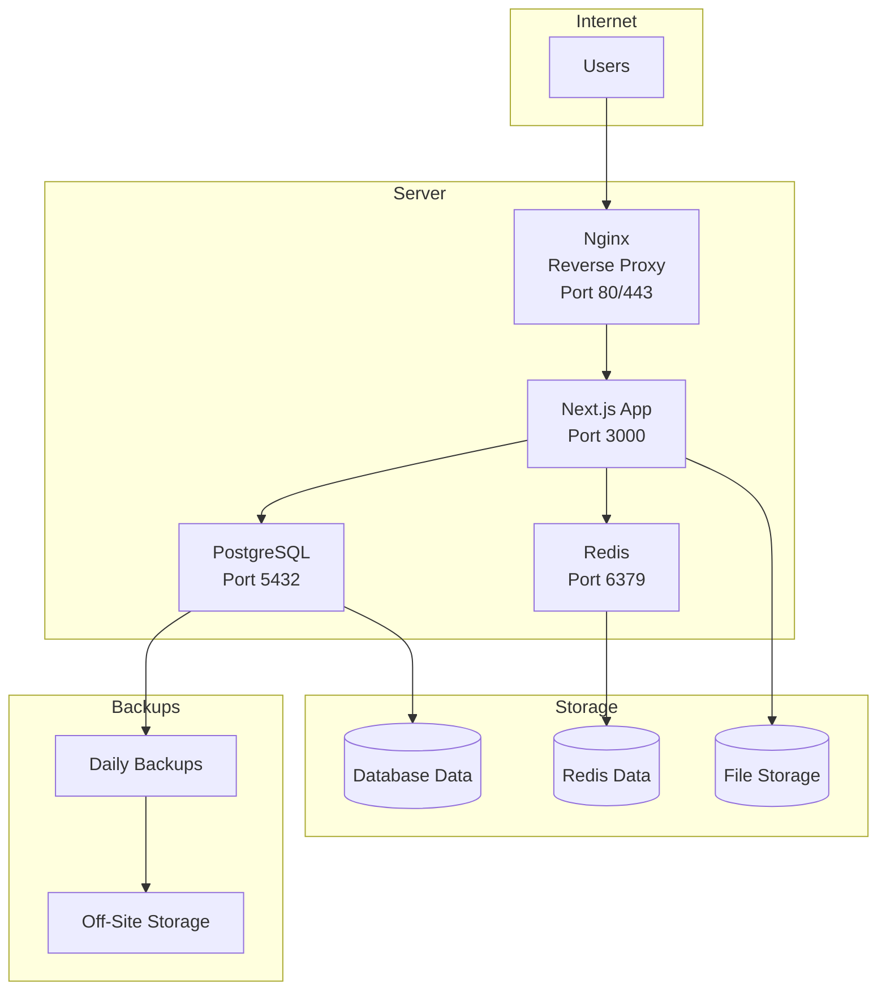

---

## RBAC Permission Flow

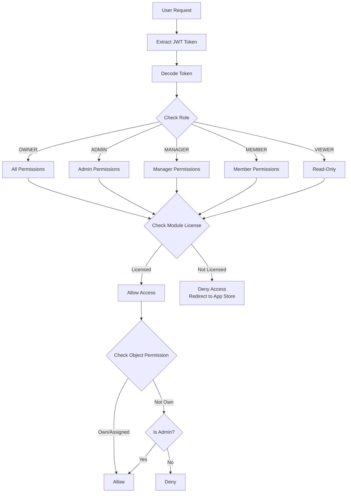

---

## Workflow Execution Flow

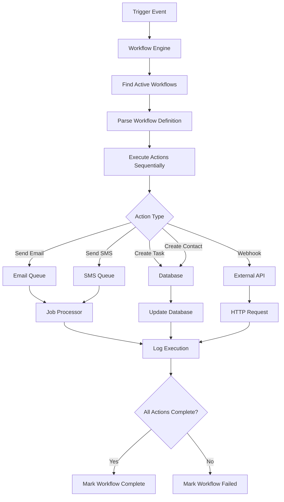

---

## Summary

These diagrams provide visual representations of PayAid V3's architecture, data flows, and system components. They complement the detailed documentation in other parts and help visualize the system's structure and behavior.

**Diagrams Included:**
- ✅ System architecture (high-level)
- ✅ Multi-tenant architecture
- ✅ Authentication & authorization flow
- ✅ Payment processing flow
- ✅ Caching architecture
- ✅ AI agent system architecture
- ✅ Module architecture
- ✅ Database schema relationships
- ✅ Deployment architecture
- ✅ RBAC permission flow
- ✅ Workflow execution flow
